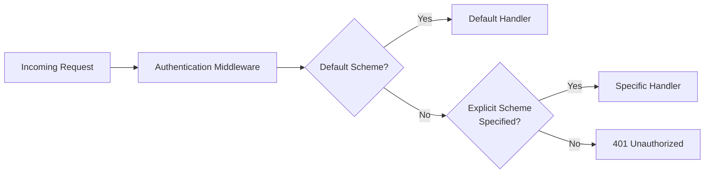

<!-- Source: https://learn.microsoft.com/en-us/entra/msidweb/advanced/multiple-auth-schemes -->
<!-- Sitemap-Last-Modified: 2026-04-29 -->

# Configure multiple authentication schemes in Microsoft.Identity.Web

Microsoft.Identity.Web supports multiple authentication schemes in a single ASP.NET Core application. Use this approach when your application handles different types of authentication simultaneously.

By default, ASP.NET Core uses a single default authentication scheme. However, many real-world applications need multiple schemes:

| Scenario | Schemes Involved |
| --- | --- |
| Web app that also exposes an API | OpenID Connect + JWT Bearer |
| API accepting tokens from multiple identity providers | Multiple JWT Bearer schemes |
| API with both user and service-to-service authentication | JWT Bearer + API Key/Certificate |
| Hybrid authentication for migration | Legacy scheme + Modern OAuth |

## Understand authentication scheme flow

The following diagram shows how ASP.NET Core resolves authentication schemes when processing a request.



---

## Explore common scenarios

The following scenarios demonstrate typical multi-scheme configurations.

### Scenario 1: Web app + Web API in same project

Your application serves both web pages \(using cookies/OpenID Connect\) and API endpoints \(using JWT Bearer tokens\). The following code registers both schemes:

```csharp
using Microsoft.AspNetCore.Authentication.JwtBearer;
using Microsoft.AspNetCore.Authentication.OpenIdConnect;
using Microsoft.Identity.Web;

var builder = WebApplication.CreateBuilder(args);

// Add OpenID Connect for web app (browser sign-in)
builder.Services.AddAuthentication(OpenIdConnectDefaults.AuthenticationScheme)
    .AddMicrosoftIdentityWebApp(builder.Configuration.GetSection("AzureAd"))
    .EnableTokenAcquisitionToCallDownstreamApi()
    .AddInMemoryTokenCaches();

// Add JWT Bearer for API endpoints
builder.Services.AddAuthentication()
    .AddMicrosoftIdentityWebApi(builder.Configuration.GetSection("AzureAd"), 
        JwtBearerDefaults.AuthenticationScheme);

builder.Services.AddControllersWithViews();

var app = builder.Build();

app.UseAuthentication();
app.UseAuthorization();

app.MapControllers();
app.Run();
```

### Scenario 2: Multiple Identity providers

Accept tokens from both Microsoft Entra ID and Azure AD B2C. The following code registers a primary and secondary scheme:

```csharp
builder.Services.AddAuthentication(JwtBearerDefaults.AuthenticationScheme)
    // Primary scheme: Microsoft Entra ID
    .AddMicrosoftIdentityWebApi(builder.Configuration.GetSection("AzureAd"), 
        JwtBearerDefaults.AuthenticationScheme)
    // Secondary scheme: Azure AD B2C
    .AddMicrosoftIdentityWebApi(builder.Configuration.GetSection("AzureAdB2C"), 
        "AzureAdB2C");
```

**appsettings.json:**

```json
{
  "AzureAd": {
    "Instance": "https://login.microsoftonline.com/",
    "TenantId": "your-tenant-id",
    "ClientId": "your-api-client-id"
  },
  "AzureAdB2C": {
    "Instance": "https://your-tenant.b2clogin.com/",
    "Domain": "your-tenant.onmicrosoft.com",
    "TenantId": "your-b2c-tenant-id",
    "ClientId": "your-b2c-api-client-id",
    "SignUpSignInPolicyId": "B2C_1_SignUpSignIn"
  }
}
```

---

## Configure authentication schemes

Register and configure your authentication schemes during application startup.

### Register multiple schemes

The following code sets a default scheme and registers both JWT Bearer and OpenID Connect:

```csharp
using Microsoft.AspNetCore.Authentication;
using Microsoft.AspNetCore.Authentication.JwtBearer;
using Microsoft.AspNetCore.Authentication.OpenIdConnect;
using Microsoft.Identity.Web;

var builder = WebApplication.CreateBuilder(args);

// Set the default authentication scheme (can also do with AddAuthentication(scheme))
builder.Services.AddAuthentication(options =>
{
    options.DefaultScheme = JwtBearerDefaults.AuthenticationScheme;
    options.DefaultChallengeScheme = JwtBearerDefaults.AuthenticationScheme;
})
// Add JWT Bearer (primary)
.AddMicrosoftIdentityWebApi(builder.Configuration.GetSection("AzureAd"), 
    JwtBearerDefaults.AuthenticationScheme)
// Add OpenID Connect (secondary)
.AddMicrosoftIdentityWebApp(builder.Configuration.GetSection("AzureAd"), 
    OpenIdConnectDefaults.AuthenticationScheme);
```

### Define named schemes

Define named constants for your schemes to improve readability and prevent typos:

```csharp
public static class AuthSchemes
{
    public const string AzureAd = "AzureAd";
    public const string AzureAdB2C = "AzureAdB2C";
}

builder.Services.AddAuthentication(AuthSchemes.AzureAd)
    .AddMicrosoftIdentityWebApi(builder.Configuration.GetSection("AzureAd"), AuthSchemes.AzureAd)
    .AddMicrosoftIdentityWebApi(builder.Configuration.GetSection("AzureAdB2C"), AuthSchemes.AzureAdB2C);
```

---

## Specify schemes in controllers

Apply the `[Authorize]` attribute to controllers and actions to control which authentication scheme handles each request.

### Use the \[Authorize\] attribute

Specify which authentication scheme to use for a controller or action:

```csharp
using Microsoft.AspNetCore.Authentication.JwtBearer;
using Microsoft.AspNetCore.Authorization;
using Microsoft.AspNetCore.Mvc;

// Use default scheme
[Authorize]
[ApiController]
[Route("api/[controller]")]
public class DefaultController : ControllerBase
{
    [HttpGet]
    public IActionResult Get() => Ok("Using default scheme");
}

// Use specific scheme
[Authorize(AuthenticationSchemes = JwtBearerDefaults.AuthenticationScheme)]
[ApiController]
[Route("api/[controller]")]
public class ApiController : ControllerBase
{
    [HttpGet]
    public IActionResult Get() => Ok("Using JWT Bearer scheme");
}

// Accept multiple schemes (any one succeeds)
[Authorize(AuthenticationSchemes = "AzureAd,AzureAdB2C")]
[ApiController]
[Route("api/[controller]")]
public class MultiSchemeController : ControllerBase
{
    [HttpGet]
    public IActionResult Get() => Ok($"Authenticated via: {User.Identity?.AuthenticationType}");
}
```

### Select schemes per action

Apply different schemes to individual actions within the same controller:

```csharp
[ApiController]
[Route("api/[controller]")]
public class MixedController : ControllerBase
{
    // This action uses JWT Bearer
    [Authorize(AuthenticationSchemes = JwtBearerDefaults.AuthenticationScheme)]
    [HttpGet("api-data")]
    public IActionResult GetApiData() => Ok("API data");

    // This action uses OpenID Connect (for browser-based calls)
    [Authorize(AuthenticationSchemes = OpenIdConnectDefaults.AuthenticationScheme)]
    [HttpGet("web-data")]
    public IActionResult GetWebData() => Ok("Web data");

    // This action accepts either scheme
    [Authorize(AuthenticationSchemes = $"{JwtBearerDefaults.AuthenticationScheme},{OpenIdConnectDefaults.AuthenticationScheme}")]
    [HttpGet("any-data")]
    public IActionResult GetAnyData() => Ok("Data for any authenticated user");
}
```

---

## Specify schemes when calling APIs

When your application uses multiple authentication schemes and calls downstream APIs, specify which scheme to use for token acquisition.

### Call Microsoft Graph

The following code specifies the authentication scheme when calling Microsoft Graph:

```csharp
using Microsoft.AspNetCore.Authentication.JwtBearer;
using Microsoft.Graph;

[Authorize]
public class GraphController : ControllerBase
{
    private readonly GraphServiceClient _graphClient;

    public GraphController(GraphServiceClient graphClient)
    {
        _graphClient = graphClient;
    }

    [HttpGet("profile")]
    public async Task<ActionResult> GetProfile()
    {
        // Specify which authentication scheme to use for token acquisition
        var user = await _graphClient.Me
            .GetAsync(r => r.Options
                .WithAuthenticationScheme(JwtBearerDefaults.AuthenticationScheme));

        return Ok(user);
    }

    [HttpGet("mail")]
    public async Task<ActionResult> GetMail()
    {
        // More detailed options including scopes and scheme
        var messages = await _graphClient.Me.Messages
            .GetAsync(r =>
            {
                r.Options.WithAuthenticationOptions(options =>
                {
                    // Specify authentication scheme
                    options.AcquireTokenOptions.AuthenticationOptionsName = 
                        JwtBearerDefaults.AuthenticationScheme;
                    
                    // Specify additional scopes if needed
                    options.Scopes = new[] { "Mail.Read" };
                });
            });

        return Ok(messages);
    }
}
```

### Call downstream APIs with IDownstreamApi

The following code specifies the authentication scheme when calling a downstream API:

```csharp
using Microsoft.Identity.Abstractions;

[Authorize]
public class DownstreamController : ControllerBase
{
    private readonly IDownstreamApi _downstreamApi;

    public DownstreamController(IDownstreamApi downstreamApi)
    {
        _downstreamApi = downstreamApi;
    }

    [HttpGet("data")]
    public async Task<ActionResult> GetData()
    {
        var result = await _downstreamApi.CallApiForUserAsync<MyData>(
            "MyApi",
            options =>
            {
                options.AcquireTokenOptions.AuthenticationOptionsName = 
                    JwtBearerDefaults.AuthenticationScheme;
            });

        return Ok(result);
    }
}
```

---

## Troubleshoot common issues

### Problem: Wrong scheme selected

**Symptoms:**

- 401 Unauthorized errors
- Token acquired with wrong permissions
- User claims missing or incorrect

**Solution:** Explicitly specify the authentication scheme in both the controller attribute and token acquisition calls:

```csharp
// In controller
[Authorize(AuthenticationSchemes = JwtBearerDefaults.AuthenticationScheme)]
public class MyApiController : ControllerBase { }

// When calling APIs
var user = await _graphClient.Me
    .GetAsync(r => r.Options.WithAuthenticationScheme(JwtBearerDefaults.AuthenticationScheme));
```

### Problem: Multiple schemes conflict

**Symptoms:**

- Authentication works for one scheme but not another
- Unexpected redirects or challenges

**Solution:** Set default schemes explicitly in your authentication configuration:

```csharp
builder.Services.AddAuthentication(options =>
{
    // Default for API calls
    options.DefaultScheme = JwtBearerDefaults.AuthenticationScheme;
    options.DefaultAuthenticateScheme = JwtBearerDefaults.AuthenticationScheme;
    
    // Default for unauthenticated challenges (redirects)
    options.DefaultChallengeScheme = JwtBearerDefaults.AuthenticationScheme;
});
```

### Problem: Token cache conflicts

**Symptoms:**

- Tokens cached for wrong scheme
- Incorrect user context

**Solution:** Use scheme-aware token acquisition to ensure the correct cache is used:

```csharp
// Specify the authentication scheme when acquiring tokens
var accessToken = await _tokenAcquisition.GetAccessTokenForUserAsync(
    scopes,
    authenticationScheme: "AzureAdB2C");
```

### Problem: Authorization policies don't work

**Symptoms:**

- Policy requirements not enforced
- Claims not found

**Solution:** Ensure the policy references the correct scheme:

```csharp
builder.Services.AddAuthorization(options =>
{
    options.AddPolicy("ApiPolicy", policy =>
    {
        policy.AuthenticationSchemes.Add(JwtBearerDefaults.AuthenticationScheme);
        policy.RequireAuthenticatedUser();
        policy.RequireClaim("scope", "access_as_user");
    });
});
```

---

## Follow best practices

Apply these practices to keep your multi-scheme configuration maintainable.

### 1. Use constants for scheme names

Define scheme names as constants to avoid typos and improve refactoring. Use `SchemeDefaults.AuthenticationScheme` where available, or define a static class:

```csharp
public static class AuthSchemes
{
    public const string Primary = JwtBearerDefaults.AuthenticationScheme;
    public const string B2C = "AzureAdB2C";
    public const string Internal = "InternalApi";
}

// Usage
[Authorize(AuthenticationSchemes = AuthSchemes.Primary)]
public class MyController : ControllerBase { }
```

### 2. Document your scheme configuration

Add XML documentation to your authentication setup so other developers understand which schemes are configured and their purpose:

```csharp
/// <summary>
/// Configures authentication for the application.
/// 
/// Schemes configured:
/// - JwtBearer (default): For API clients using Microsoft Entra tokens
/// - AzureAdB2C: For consumer-facing API clients using B2C tokens
/// - OpenIdConnect: For browser-based authentication (web app)
/// </summary>
public static IServiceCollection AddApplicationAuthentication(
    this IServiceCollection services, 
    IConfiguration configuration)
{
    // Implementation...
}
```

### 3. Test each scheme independently

Create integration tests that verify each scheme works correctly. The following tests validate JWT Bearer and B2C token authentication separately:

```csharp
[Fact]
public async Task Api_WithJwtBearerToken_ReturnsSuccess()
{
    var token = await GetJwtBearerTokenAsync();
    _client.DefaultRequestHeaders.Authorization = 
        new AuthenticationHeaderValue("Bearer", token);
    
    var response = await _client.GetAsync("/api/data");
    
    Assert.Equal(HttpStatusCode.OK, response.StatusCode);
}

[Fact]
public async Task Api_WithB2CToken_ReturnsSuccess()
{
    var token = await GetB2CTokenAsync();
    _client.DefaultRequestHeaders.Authorization = 
        new AuthenticationHeaderValue("Bearer", token);
    
    var response = await _client.GetAsync("/api/data");
    
    Assert.Equal(HttpStatusCode.OK, response.StatusCode);
}
```

---

## Related content

- [Authorization in Web APIs](https://learn.microsoft.com/en-us/entra/msidweb/authentication/authorization) - Scope and role validation
- [Calling Microsoft Graph](https://learn.microsoft.com/en-us/entra/msidweb/call-downstream-apis/microsoft-graph) - Graph SDK integration
- [Calling Downstream APIs](https://learn.microsoft.com/en-us/entra/msidweb/call-downstream-apis/overview) - API call patterns
- [Deploying Behind Gateways](https://learn.microsoft.com/en-us/entra/msidweb/advanced/api-gateways) - Gateway authentication scenarios
- [Logging and Diagnostics](https://learn.microsoft.com/en-us/entra/msidweb/advanced/logging) - Troubleshooting authentication issues
