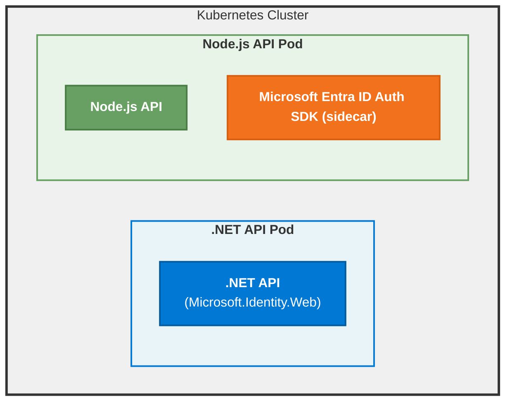

<!-- Source: https://learn.microsoft.com/en-us/entra/msidweb/agent-id-sdk/comparison -->
<!-- Sitemap-Last-Modified: 2026-06-16 -->

# Comparison: Microsoft Entra ID Auth SDK \(sidecar\) vs. In-Process Microsoft.Identity.Web

This guide helps you identify the differences between the Microsoft Entra ID Auth SDK \(sidecar\) and the in-process Microsoft.Identity.Web library for handling authentication in your applications. The Microsoft.Identity.Web library integrates directly into .NET applications for maximum performance. The Microsoft Entra ID Auth SDK \(sidecar\) runs as a separate container and supports any programming language via HTTP APIs. Choosing the correct approach depends on your application's architecture, language, and deployment environment.

## Architectural differences

The fundamental difference lies in **where authentication logic executes**. Microsoft.Identity.Web runs within your application process. The Microsoft Entra ID Auth SDK \(sidecar\) operates as an independent service alongside your application. This architectural choice impacts factors such as development workflow and operational complexity.

| Aspect | Microsoft.Identity.Web \(In-Process\) | Microsoft Entra ID Auth SDK \(sidecar\) \(Out-of-Process\) |
| --- | --- | --- |
| **Process Boundary** | Shares the same process, memory, and lifecycle as your application, enabling direct method calls and shared configuration | Maintains complete isolation, communicating only through HTTP APIs and managing its own resources independently |
| **Language Coupling** | Tightly couples your authentication strategy to .NET, requiring C# experience and .NET runtime everywhere you need authentication | Decouples authentication from your application's technology stack, exposing a language-agnostic HTTP interface that works equally well with Python, Node.js, Go, or any HTTP-capable language |
| **Deployment Model** | Deploys as NuGet packages embedded in your application binary, creating a monolithic deployment unit | Deploys as a separate container image, enabling independent versioning, scaling, and updates of authentication logic without impacting your application code |

### Microsoft.Identity.Web \(in-process\)

This code snippet shows how Microsoft.Identity.Web integrates directly into an ASP.NET Core application:

```csharp
// Startup configuration
services.AddMicrosoftIdentityWebApiAuthentication(Configuration)
    .EnableTokenAcquisitionToCallDownstreamApi()
    .AddDownstreamApi("Graph", Configuration.GetSection("DownstreamApis:Graph"))
    .AddInMemoryTokenCaches();

// Usage in controller
public class MyController : ControllerBase
{
    private readonly IDownstreamApi _downstreamApi;
    
    public MyController(IDownstreamApi downstreamApi)
    {
        _downstreamApi = downstreamApi;
    }
    
    public async Task<ActionResult> GetUserData()
    {
        var user = await _downstreamApi.GetForUserAsync<User>("Graph", 
            options => options.RelativePath = "me");
        return Ok(user);
    }
}
```

### Microsoft Entra ID Auth SDK \(sidecar\) \(Out-of-Process\)

This code snippet demonstrates how to call the Microsoft Entra ID Auth SDK \(sidecar\) from a Node.js application using HTTP. The call to the SDK's `/DownstreamApi` endpoint handles token acquisition and downstream API calls, including passing the incoming token for OBO flows in the `Authorization` header:

```typescript
// Configuration
const SidecarUrl = process.env.SIDECAR_URL || "http://localhost:5000";

// Usage in application
async function getUserData(incomingToken: string) {
  const response = await fetch(
    `${SidecarUrl}/DownstreamApi/Graph?optionsOverride.RelativePath=me`,
    {
      headers: {
        'Authorization': `Bearer ${incomingToken}`
      }
    }
  );
  
  const result = await response.json();
  return JSON.parse(result.content);
}
```

## Feature comparison

| Feature | Microsoft.Identity.Web | Microsoft Entra ID Auth SDK \(sidecar\) |
| --- | --- | --- |
| **Language Support** | C# / .NET only | Any language \(HTTP\) |
| **Deployment** | In-process library | Separate container |
| **Token Acquisition** | Direct MSAL.NET | Via HTTP API |
| **Token Caching** | In-memory, distributed | In-memory, distributed |
| **OBO Flow** | Native support | Via HTTP endpoint |
| **Client Credentials** | Native support | Via HTTP endpoint |
| **Managed Identity** | Direct support | Direct support |
| **Agent Identities** | Via extensions | Query parameters |
| **Token Validation** | Middleware | /Validate endpoint |
| **Downstream API** | IDownstreamApi | /DownstreamApi endpoint |
| **Microsoft Graph** | Graph SDK integration | Via DownstreamApi |
| **Performance** | In-process \(fastest\) | HTTP overhead |
| **Configuration** | `appsettings.json` and code | `appsettings.json` and environment variables |
| **Debugging** | Standard .NET debugging | Container debugging |
| **Hot Reload** | .NET Hot Reload | Container restart |
| **Package Updates** | NuGet packages | Container images |
| **License** | MIT | MIT |

## When to use each approach

Deciding between Microsoft.Identity.Web and the Microsoft Entra ID Auth SDK \(sidecar\) depends on your application's requirements, architecture, and deployment strategy. Depending on your needs, one approach might be more suitable than the other. The following guidelines can help you make an informed decision.

| Scenario | Microsoft.Identity.Web \(In-Process\) | Microsoft Entra ID Auth SDK \(sidecar\) \(Out-of-Process\) |
| --- | --- | --- |
| **Application Stack** | .NET applications exclusively  <br>• ASP.NET Core Web APIs  <br>• ASP.NET Core Web Apps  <br>• .NET Worker Services  <br>• Blazor applications  <br>• Daemon apps | Multi-language microservices  <br>• Node.js, Python, Go, Java services  <br>• Polyglot architectures  <br>• Non-.NET services  <br>• Legacy systems integration |
| **Performance Requirements** | Performance is critical  <br>• High-throughput scenarios  <br>• Latency-sensitive operations  <br>• Every millisecond counts | Can tolerate HTTP overhead  <br>• ~1-5ms additional latency acceptable  <br>• Throughput not bottlenecked by auth |
| **Integration Needs** | Deep integration required  <br>• Custom MSAL.NET configuration  <br>• Direct access to MSAL features  <br>• Advanced token cache strategies | Standardized integration  <br>• HTTP API sufficient  <br>• Consistent auth patterns across services |
| **Development Experience** | Rapid development  <br>• Quick prototyping  <br>• Hot reload for development  <br>• Standard .NET debugging | Container-based development  <br>• Container restart for changes  <br>• Container debugging required |
| **Team & Architecture** | Single-language stack  <br>• Team expertise in C#/.NET  <br>• No multi-language requirements | Technology diversity  <br>• Mix of frameworks and languages  <br>• Polyglot team structure |
| **Deployment Model** | Monolithic deployments  <br>• Single application deployment  <br>• Traditional hosting models | Containerized deployments  <br>• Kubernetes environments  <br>• Docker Compose setups  <br>• Service mesh architectures |
| **Operations** | Coupled auth updates  <br>• Auth changes require app rebuild  <br>• Shared lifecycle with application | Operational benefits  <br>• Independent scaling of auth logic  <br>• Separate auth updates from app code  <br>• Centralized monitoring of auth |

## Migration guidance

### Migrating from Microsoft.Identity.Web to Microsoft Entra ID Auth SDK \(sidecar\)

In certain scenarios, you might want to migrate an existing .NET application that uses Microsoft.Identity.Web to leverage the Microsoft Entra ID Auth SDK \(sidecar\) for authentication. Reasons for migration could include adopting a multi-language architecture, standardizing authentication across services, or moving to a containerized deployment model.

Careful consideration and planning are required before you make this change. This section provides a high-level migration path with code examples to help you transition your application.

Caution

Microsoft doesn't recommend moving from Microsoft.Identity.Web to the Microsoft Entra ID Auth SDK \(sidecar\). If you choose to make this change, the following examples demonstrate similar concepts in other languages and frameworks.

#### Step 1: Deploy SDK container

First, add the SDK container to your pod:

```yaml
# Before: Single ASP.NET Core container
containers:
- name: app
  image: myregistry/myapp:latest

# After: App + Microsoft Entra ID Auth SDK (sidecar)
containers:
- name: app
  image: myregistry/myapp:latest
  env:
  - name: SIDECAR_URL
    value: "http://localhost:5000"

- name: sidecar
  image: mcr.microsoft.com/entra-sdk/auth-sidecar:1.0.0
  env:
  - name: AzureAd__TenantId
    value: "your-tenant-id"
  - name: AzureAd__ClientId
    value: "your-client-id"
```

#### Step 2: Migrate configuration

Next, transfer your configuration from `appsettings.json` to environment variables:

**Before \(appsettings.json\)**

```json
{
  "AzureAd": {
    "Instance": "https://login.microsoftonline.com/",
    "TenantId": "your-tenant-id",
    "ClientId": "your-client-id"
  },
  "DownstreamApis": {
    "Graph": {
      "BaseUrl": "https://graph.microsoft.com/v1.0",
      "Scopes": "User.Read Mail.Read", 
      "RelativePath": "/me"
    }
  }
}
```

**After \(Kubernetes ConfigMap / Environment Variables\)**

```yaml
apiVersion: v1
kind: ConfigMap
metadata:
  name: sidecar-config
data:
  AzureAd__Instance: "https://login.microsoftonline.com/"
  AzureAd__TenantId: "your-tenant-id"
  AzureAd__ClientId: "your-client-id"
  DownstreamApis__Graph__BaseUrl: "https://graph.microsoft.com/v1.0"
  DownstreamApis__Graph__Scopes: "User.Read Mail.Read"
  DownstreamApis__Graph__RelativePath: "/me"
```

#### Step 3: Update application code

Locate all instances of in-process calls to Microsoft.Identity.Web and replace them with HTTP calls to the Microsoft Entra ID Auth SDK \(sidecar\) endpoints:

**Before \(C# with IDownstreamApi\)**:

```csharp
public class UserController : ControllerBase
{
    private readonly IDownstreamApi _downstreamApi;
    
    public UserController(IDownstreamApi downstreamApi)
    {
        _downstreamApi = downstreamApi;
    }
    
    [HttpGet]
    public async Task<ActionResult<User>> GetMe()
    {
        var user = await _downstreamApi.GetForUserAsync<User>(
            "Graph",
            options => options.RelativePath = "me"
        );
        return Ok(user);
    }
}
```

**After \(Any language with HTTP client\)**:

In the following snippet, you see calls to the Microsoft Entra ID Auth SDK \(sidecar\) using the `/DownstreamApi` endpoint to get user data. Examples are provided in C# and TypeScript.

```csharp
public class UserController : ControllerBase
{
    private readonly HttpClient _httpClient;
    private readonly string _SidecarUrl;
    
    public UserController(IHttpClientFactory httpClientFactory, IConfiguration config)
    {
        _httpClient = httpClientFactory.CreateClient();
        _SidecarUrl = config["SIDECAR_URL"];
    }
    
    [HttpGet]
    public async Task<ActionResult<User>> GetMe()
    {
        var inboundAuthorizationHeader = Request.Headers["Authorization"].ToString();
        // this validates the inbound authorization header and calls the downstream API.
        // If you don't call a downstream API, Do validate the inbound authorization header 
        // (calling the /Validate endpoint)
        var request = new HttpRequestMessage(
            HttpMethod.Get,
            $"{_SidecarUrl}/DownstreamApi/Graph?optionsOverride.RelativePath=me"
        );
        request.Headers.Add("Authorization", inboundAuthorizationHeader);
        
        var response = await _httpClient.SendAsync(request);
        var result = await response.Content.ReadFromJsonAsync<SidecarResponse>();
        var user = JsonSerializer.Deserialize<User>(result.Content);
        return Ok(user);
    }
}
```

### TypeScript

You can implement the same logic in TypeScript as follows:

```typescript
export async function getMe(incomingToken: string): Promise<User> {
  const SidecarUrl = process.env.SIDECAR_URL!;
  
  const response = await fetch(
    `${SidecarUrl}/DownstreamApi/Graph?optionsOverride.RelativePath=me`,
    {
      headers: {
        'Authorization': incomingToken
      }
    }
  );
  
  const result = await response.json();
  return JSON.parse(result.content) as User;
}
```

#### Step 4: Remove Microsoft.Identity.Web dependencies

After you complete the previous steps, tidy your application by removing the NuGet packages for Microsoft.Identity.Web from your project:

```xml
<!-- Remove these from .csproj -->
<PackageReference Include="Microsoft.Identity.Web" Version="..." />
<PackageReference Include="Microsoft.Identity.Web.MicrosoftGraph" Version="..." />
<PackageReference Include="Microsoft.Identity.Web.DownstreamApi" Version="..." />
```

If you still want to validate tokens in your app, you don't need to remove the original authentication configuration. Instead, you can delegate validation entirely to the Microsoft Entra ID Auth SDK \(sidecar\).

```csharp
// Remove from Program.cs or Startup.cs
services.AddMicrosoftIdentityWebApiAuthentication(Configuration)
    .EnableTokenAcquisitionToCallDownstreamApi()
    .AddDownstreamApi("Graph", Configuration.GetSection("DownstreamApis:Graph"))
    .AddInMemoryTokenCaches();
```

#### Step 5: Test and validate

1. **Unit tests**: Update tests to mock HTTP calls to the SDK.
2. **Integration tests**: Test SDK communication in staging.
3. **Performance tests**: Measure HTTP overhead impact.
4. **Security tests**: Validate token handling and network policies.

## Performance considerations

### SDK overhead

The Microsoft Entra ID Auth SDK \(sidecar\) introduces HTTP communication overhead:

| Performance Factor | Impact | Mitigation Strategy |
| --- | --- | --- |
| **Latency** | Approximately 1-5 ms per request for localhost communication | Use HTTP/2 to reduce connection overhead. |
| **Throughput** | Limited by HTTP connection pooling | Implement connection pooling to reuse HTTP connections. |
| **Memory** | Additional container memory overhead | Ensure adequate SDK resource allocation. |
| **Request Efficiency** | Multiple round trips for complex operations | Batch requests to combine multiple operations when possible. |
| **Token Performance** | Repeated token acquisition overhead | Leverage SDK's token cache for optimal performance. |

### In-Process performance

Using Microsoft.Identity.Web has minimal overhead since it runs within the same process as your application. It provides native method calls with microsecond latency and shared process memory without HTTP limitations. When performance is critical, in-process integration is the optimal choice. However, the Microsoft Entra ID Auth SDK \(sidecar\)'s flexibility and language-agnostic design might outweigh the performance trade-offs in many scenarios.

The following table shows some performance and cost comparisons for in-process usage and Microsoft Entra ID Auth SDK \(sidecar\) \(Out-of-Process\) usage:

## Cost considerations

| Cost Factor | Microsoft.Identity.Web \(In-Process\) | Microsoft Entra ID Auth SDK \(sidecar\) \(Out-of-Process\) |
| --- | --- | --- |
| **Compute** | Minimal additional CPU and memory in application process | Additional container resources per pod. |
| **Network** | No additional overhead | Minimal localhost communication. |
| **Storage** | NuGet package size \(~10 MB\) | Container image storage. |
| **Management** | No additional overhead | Container orchestration overhead. |

### Cost example

For 10 replicas with 128 MiB/100m SDK configuration:

| Resource | In-Process | Microsoft Entra ID Auth SDK \(sidecar\) |
| --- | --- | --- |
| **Memory** | ~0 MB additional | 10 × 128 MiB = 1.28 GB |
| **CPU** | ~0% additional | 10 × 100m = 1 core |
| **Storage** | ~10 MB per deployment | Container image size per node |

## Support and maintenance

| Aspect | Microsoft.Identity.Web | Microsoft Entra ID Auth SDK \(sidecar\) |
| --- | --- | --- |
| **Updates** | NuGet package updates | Container image updates |
| **Breaking Changes** | Via package versioning | Via container tags |
| **Bug Fixes** | Compile-time integration | Runtime container updates |
| **Security Patches** | Rebuild application | Redeploy container |
| **Documentation** | Extensive .NET docs | This documentation |
| **Community** | Large .NET community | Growing community |

## Hybrid approach

You can combine both approaches within the same architecture. Use Microsoft.Identity.Web for .NET services that require maximum performance, and use the Microsoft Entra ID Auth SDK \(sidecar\) for non-.NET services or when you need language-agnostic authentication patterns. This hybrid strategy helps you optimize performance where it's critical while maintaining consistency and flexibility across your entire service ecosystem.

An example architecture is as follows:



## Related content

- [Installation Guide](https://learn.microsoft.com/en-us/entra/msidweb/agent-id-sdk/installation)
- [Configuration Reference](https://learn.microsoft.com/en-us/entra/msidweb/agent-id-sdk/configuration)
- [Call Downstream API](https://learn.microsoft.com/en-us/entra/msidweb/agent-id-sdk/scenarios/call-downstream-api)
- [Overview](https://learn.microsoft.com/en-us/entra/msidweb/agent-id-sdk/overview)
