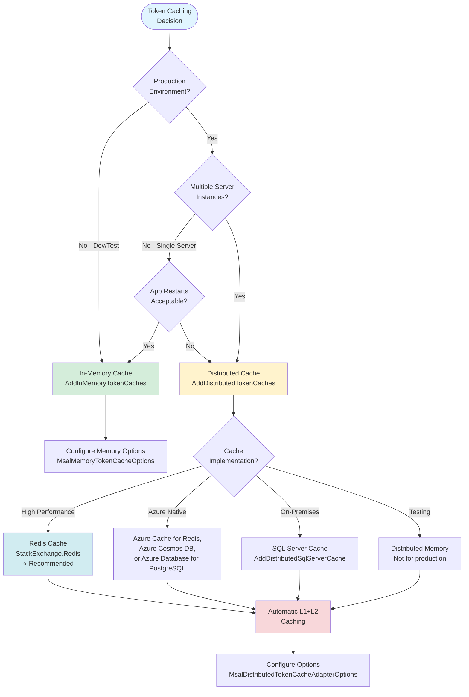

<!-- Source: https://learn.microsoft.com/en-us/entra/msidweb/authentication/token-cache-overview -->
<!-- Sitemap-Last-Modified: 2026-04-29 -->

# Token cache in Microsoft.Identity.Web

Token caching improves application performance, reliability, and user experience. Microsoft.Identity.Web provides flexible caching strategies that balance performance, persistence, and operational reliability.

## Overview

This section describes which tokens Microsoft.Identity.Web caches and why caching matters for your application.

### What tokens are cached?

Microsoft.Identity.Web caches several types of tokens:

| Token Type | Size | Scope | Eviction |
| --- | --- | --- | --- |
| **Access Tokens** | ~2 KB | Per \(user/app, tenant, resource\) | Automatic \(lifetime-based\) |
| **Refresh Tokens** | Variable | Per user account | Manual or policy-based |
| **ID Tokens** | ~2-7 KB | Per user | Automatic |

**Where token caching applies:**

- **[Web apps calling APIs](https://learn.microsoft.com/en-us/entra/msidweb/call-downstream-apis/from-web-apps)** - User tokens for delegated access
- **[Web APIs calling downstream APIs](https://learn.microsoft.com/en-us/entra/msidweb/call-downstream-apis/from-web-apis)** - OBO tokens \(requires careful eviction policies\)
- **Daemon applications** - App-only tokens for service-to-service calls

### Why cache tokens?

**Performance Benefits:**

- Reduces round trips to Microsoft Entra ID
- Faster API calls \(L1: <10ms vs L2: ~30ms vs network: >100ms\)
- Lower latency for end users

**Reliability Benefits:**

- Continues working during temporary Microsoft Entra outages
- Resilient to network transients
- Graceful degradation when distributed cache fails

**Cost Benefits:**

- Reduces authentication requests \(throttling avoidance\)
- Lower Azure costs for authentication operations

---

## Quickstart

Get started quickly with one of the following cache configurations, depending on your environment.

### Development - in-memory cache

The following example adds an in-memory token cache, suitable for development and samples:

```csharp
using Microsoft.Identity.Web;

builder.Services.AddMicrosoftIdentityWebAppAuthentication(builder.Configuration, "AzureAd")
    .EnableTokenAcquisitionToCallDownstreamApi()
    .AddInMemoryTokenCaches();
```

**Advantages:**

- Simple setup
- Fast performance
- No external dependencies

**Disadvantages:**

- Cache lost on app restart. In a web app, users remain signed in via the cookie but must re-sign in to get an access token and repopulate the cache
- Not suitable for production multi-server deployments
- Not shared across application instances

---

### Production - distributed cache

For production applications, especially multi-server deployments, use a distributed cache backed by Redis or another provider:

```csharp
using Microsoft.Identity.Web;

builder.Services.AddMicrosoftIdentityWebAppAuthentication(builder.Configuration, "AzureAd")
    .EnableTokenAcquisitionToCallDownstreamApi()
    .AddDistributedTokenCaches();

// Choose your cache implementation
builder.Services.AddStackExchangeRedisCache(options =>
{
    options.Configuration = builder.Configuration.GetConnectionString("Redis");
    options.InstanceName = "MyApp_";
});
```

**Advantages:**

- Survives app restarts
- Shared across all application instances
- Automatic L1+L2 caching

**Disadvantages:**

- Requires external cache infrastructure
- Additional configuration complexity
- Network latency for cache operations

---

## Choosing a cache strategy

Use the following decision flowchart and matrix to select the cache strategy that best fits your deployment.



### Decision matrix

The following table summarizes recommended cache types for common deployment scenarios.

| Scenario | Recommended Cache | Rationale |
| --- | --- | --- |
| **Local development** | In-Memory | Simplicity, no infrastructure needed |
| **Samples/demos** | In-Memory | Easy setup for demonstrations |
| **Single-server production \(restarts OK\)** | In-Memory | Acceptable if sessions can be re-established |
| **Multi-server production** | Redis | Shared cache, high performance, reliable |
| **Azure-hosted applications** | Azure Cache for Redis | Native Azure integration, managed service |
| **On-premises enterprise** | SQL Server | Leverages existing infrastructure |
| **PostgreSQL environments** | PostgreSQL | Uses existing PostgreSQL database, familiar SQL semantics |
| **High-security environments** | SQL Server + Encryption | Data residency, encryption at rest |
| **Testing distributed scenarios** | Distributed Memory | Tests L2 cache behavior without infrastructure |

---

## Cache implementations

Microsoft.Identity.Web supports several cache implementations. Choose the one that matches your infrastructure and availability requirements.

### In-memory cache

**When to use:**

- Development and testing
- Single-server deployments with acceptable restart behavior
- Samples and prototypes

**Configuration:**

The following code registers the in-memory token cache with default settings:

```csharp
builder.Services.AddMicrosoftIdentityWebAppAuthentication(builder.Configuration, "AzureAd")
    .EnableTokenAcquisitionToCallDownstreamApi()
    .AddInMemoryTokenCaches();
```

**With custom options:**

You can customize expiration and size limits by passing options:

```csharp
builder.Services.AddMicrosoftIdentityWebAppAuthentication(builder.Configuration, "AzureAd")
    .EnableTokenAcquisitionToCallDownstreamApi()
    .AddInMemoryTokenCaches(options =>
    {
        // Token cache entry will expire after this duration
        options.AbsoluteExpirationRelativeToNow = TimeSpan.FromHours(1);

        // Limit cache size (default is unlimited)
        options.SizeLimit = 500 * 1024 * 1024; // 500 MB
    });
```

[→ Learn more about in-memory cache configuration](#in-memory-cache)

---

### Distributed cache \(L2\) with automatic L1 support

**When to use:**

- Production multi-server deployments
- Applications requiring cache persistence across restarts
- High-availability scenarios

**Key feature:** Since Microsoft.Identity.Web v1.8.0, the distributed cache automatically includes an in-memory L1 cache for performance and reliability.

#### Redis cache \(recommended\)

Add the Redis connection string to **appsettings.json**:

```json
{
  "ConnectionStrings": {
    "Redis": "localhost:6379"
  }
}
```

Then register the distributed token cache and Redis provider in **Program.cs**:

```csharp
using Microsoft.Identity.Web;
using Microsoft.Identity.Web.TokenCacheProviders.Distributed;

builder.Services.AddMicrosoftIdentityWebAppAuthentication(builder.Configuration, "AzureAd")
    .EnableTokenAcquisitionToCallDownstreamApi()
    .AddDistributedTokenCaches();

// Redis cache implementation
builder.Services.AddStackExchangeRedisCache(options =>
{
    options.Configuration = builder.Configuration.GetConnectionString("Redis");
    options.InstanceName = "MyApp_"; // Unique prefix per application
});

// Optional: Configure distributed cache behavior
builder.Services.Configure<MsalDistributedTokenCacheAdapterOptions>(options =>
{
    // Control L1 cache size
    options.L1CacheOptions.SizeLimit = 500 * 1024 * 1024; // 500 MB

    // Handle L2 cache failures gracefully
    options.OnL2CacheFailure = (exception) =>
    {
        if (exception is StackExchange.Redis.RedisConnectionException)
        {
            // Log the failure
            // Optionally attempt reconnection
            return true; // Retry the operation
        }
        return false; // Don't retry
    };
});
```

#### Azure Cache for Redis

To use Azure Cache for Redis, register the cache with your Azure connection string:

```csharp
builder.Services.AddStackExchangeRedisCache(options =>
{
    options.Configuration = builder.Configuration.GetConnectionString("AzureRedis");
    options.InstanceName = "MyApp_";
});
```

**Connection string format:**

```
<cache-name>.redis.cache.windows.net:6380,password=<access-key>,ssl=True,abortConnect=False
```

#### SQL Server cache

The following example configures SQL Server as the distributed cache backend:

```csharp
builder.Services.AddDistributedSqlServerCache(options =>
{
    options.ConnectionString = builder.Configuration.GetConnectionString("TokenCacheDb");
    options.SchemaName = "dbo";
    options.TableName = "TokenCache";

    // Set expiration longer than access token lifetime (default 1 hour)
    // This prevents cache entries from expiring before tokens
    options.DefaultSlidingExpiration = TimeSpan.FromMinutes(90);
});
```

#### Azure Cosmos DB cache

The following example configures Azure Cosmos DB as the distributed cache backend:

```csharp
builder.Services.AddCosmosCache((CosmosCacheOptions options) =>
{
    options.ContainerName = builder.Configuration["CosmosCache:ContainerName"];
    options.DatabaseName = builder.Configuration["CosmosCache:DatabaseName"];
    options.ClientBuilder = new CosmosClientBuilder(
        builder.Configuration["CosmosCache:ConnectionString"]);
    options.CreateIfNotExists = true;
});
```

#### PostgreSQL cache

Requires the `Microsoft.Extensions.Caching.Postgres` NuGet package.

**appsettings.json:**

```json
{
  "ConnectionStrings": {
    "PostgresCache": "Host=localhost;Database=mydb;Username=myuser;Password=mypassword"
  },
  "PostgresCache": {
    "SchemaName": "public",
    "TableName": "token_cache",
    "CreateIfNotExists": true
  }
}
```

Then register the PostgreSQL cache in **Program.cs**:

```csharp
builder.Services.AddDistributedPostgresCache(options =>
{
    options.ConnectionString = builder.Configuration.GetConnectionString("PostgresCache");
    options.SchemaName = builder.Configuration["PostgresCache:SchemaName"];
    options.TableName = builder.Configuration["PostgresCache:TableName"];
    options.CreateIfNotExists = builder.Configuration.GetValue<bool>("PostgresCache:CreateIfNotExists");
    options.DefaultSlidingExpiration = TimeSpan.FromMinutes(90);
});
```

[→ Learn more about distributed cache configuration](#distributed-cache-l2-with-automatic-l1-support)

---

### Session cache \(not recommended\)

Caution

Session-based caching has significant limitations. Use a distributed cache instead.

The following example shows session-based token caching for reference:

```csharp
using Microsoft.Identity.Web.TokenCacheProviders.Session;

// In Program.cs
builder.Services.AddSession();

builder.Services.AddMicrosoftIdentityWebAppAuthentication(builder.Configuration, "AzureAd")
    .EnableTokenAcquisitionToCallDownstreamApi()
    .AddSessionTokenCaches();

// In middleware pipeline
app.UseSession(); // Must be before UseAuthentication()
app.UseAuthentication();
app.UseAuthorization();
```

**Limitations:**

- **Cookie size issues** - Large ID tokens with many claims cause problems
- **Scope conflicts** - Cannot use with singleton `TokenAcquisition` \(e.g., Microsoft Graph SDK\)
- **Session affinity required** - Doesn't work well in load-balanced scenarios
- **Not recommended** - Use distributed cache instead

---

## Advanced configuration

These options let you fine-tune cache behavior for performance, security, and eviction policies.

### L1 cache control

The L1 \(in-memory\) cache improves performance when you use distributed caches. The following code configures L1 cache size and behavior:

```csharp
builder.Services.Configure<MsalDistributedTokenCacheAdapterOptions>(options =>
{
    // Control L1 cache size (default: 500 MB)
    options.L1CacheOptions.SizeLimit = 100 * 1024 * 1024; // 100 MB

    // Disable L1 cache if session affinity is not available
    // (forces all requests to use L2 cache for consistency)
    options.DisableL1Cache = false;
});
```

**When to disable L1:**

- No session affinity in load balancer
- Users frequently prompted for MFA due to cache inconsistency
- Trade-off: L2 access is slower \(~30ms vs ~10ms\)

---

### Cache eviction policies

Eviction policies control when cached tokens are removed. The following code sets absolute and sliding expiration:

```csharp
builder.Services.Configure<MsalDistributedTokenCacheAdapterOptions>(options =>
{
    // Absolute expiration (removed after this time, regardless of use)
    options.AbsoluteExpirationRelativeToNow = TimeSpan.FromHours(72);

    // Sliding expiration (renewed on each access)
    options.SlidingExpiration = TimeSpan.FromHours(2);
});
```

You can also configure eviction via **appsettings.json**:

```json
{
  "TokenCacheOptions": {
    "AbsoluteExpirationRelativeToNow": "72:00:00",
    "SlidingExpiration": "02:00:00"
  }
}
```

```csharp
builder.Services.Configure<MsalDistributedTokenCacheAdapterOptions>(
    builder.Configuration.GetSection("TokenCacheOptions"));
```

**Recommendations:**

- Set expiration **longer than token lifetime** \(tokens typically expire in 1 hour\)
- Default: 90 minutes sliding expiration
- Balance between memory usage and user experience
- Consider: 72 hours absolute + 2 hours sliding for good UX

[→ Learn more about cache eviction strategies](#cache-eviction-policies)

---

### Encryption at rest

To protect sensitive token data in distributed caches, enable encryption through ASP.NET Core Data Protection.

#### Single machine

On a single machine, enable encryption with the built-in Data Protection provider:

```csharp
builder.Services.Configure<MsalDistributedTokenCacheAdapterOptions>(options =>
{
    options.Encrypt = true; // Uses ASP.NET Core Data Protection
});
```

#### Distributed systems \(multiple servers\)

Important

Distributed systems **do not** share encryption keys by default. You must configure key sharing:

**Azure Key Vault \(recommended\):**

The following code persists keys to Azure Blob Storage and protects them with Azure Key Vault:

```csharp
using Microsoft.AspNetCore.DataProtection;

builder.Services.AddDataProtection()
    .PersistKeysToAzureBlobStorage(new Uri(builder.Configuration["DataProtection:BlobUri"]))
    .ProtectKeysWithAzureKeyVault(
        new Uri(builder.Configuration["DataProtection:KeyIdentifier"]),
        new DefaultAzureCredential());
```

**Certificate-based:**

The following code persists keys to a file share and protects them with an X.509 certificate:

```csharp
builder.Services.AddDataProtection()
    .PersistKeysToFileSystem(new DirectoryInfo(@"\\server\share\keys"))
    .ProtectKeysWithCertificate(
        new X509Certificate2("current.pfx", builder.Configuration["CertPassword"]))
    .UnprotectKeysWithAnyCertificate(
        new X509Certificate2("current.pfx", builder.Configuration["CertPassword"]),
        new X509Certificate2("previous.pfx", builder.Configuration["PrevCertPassword"]));
```

[→ Learn more about encryption and data protection](#encryption-at-rest)

---

## Cache performance considerations

Use the following estimates to plan cache capacity for your application.

### Token size estimates

| Token Type | Typical Size | Per | Notes |
| --- | --- | --- | --- |
| App tokens | ~2 KB | Tenant × Resource | Auto-evicted |
| User tokens | ~7 KB | User × Tenant × Resource | Manual eviction needed |
| Refresh tokens | Variable | User | Long-lived |

### Memory planning

For **500 concurrent users** calling **3 APIs**:

- User tokens: 500 × 3 × 7 KB = **10.5 MB**
- With overhead: **~15-20 MB**

For **10,000 concurrent users**:

- User tokens: 10,000 × 3 × 7 KB = **210 MB**
- With overhead: **~300-350 MB**

**Recommendation:** Set L1 cache size limit based on expected concurrent users.

## Best practices

Follow these guidelines to ensure reliable and efficient token caching.

**Use distributed cache in production** - Essential for multi-server deployments

**Set appropriate cache size limits** - Prevent unbounded memory growth

**Configure eviction policies** - Balance UX and memory usage

**Enable encryption for sensitive data** - Protect tokens at rest

**Monitor cache health** - Track hit rates, failures, and performance

**Handle L2 cache failures gracefully** - L1 cache ensures resilience

**Test cache behavior** - Verify restart scenarios and failover

**Don't use distributed memory cache in production** - Not persistent or distributed

**Don't use session cache** - Has significant limitations

**Don't set expiration shorter than token lifetime** - Forces unnecessary re-authentication

**Don't forget encryption key sharing** - Distributed systems need shared keys

## Related content

- [Token cache troubleshooting](https://learn.microsoft.com/en-us/entra/msidweb/authentication/token-cache-troubleshooting)
- [Calling downstream APIs from web apps](https://learn.microsoft.com/en-us/entra/msidweb/call-downstream-apis/from-web-apps)
- [Credentials overview](https://learn.microsoft.com/en-us/entra/msidweb/authentication/credentials-overview)
- [Quickstart: Web app](https://learn.microsoft.com/en-us/entra/msidweb/getting-started/quickstart-webapp)
