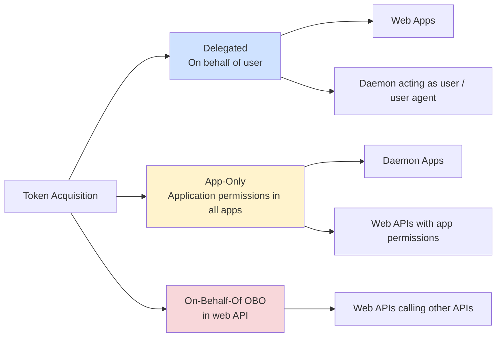

<!-- Source: https://learn.microsoft.com/en-us/entra/msidweb/call-downstream-apis/overview -->
<!-- Sitemap-Last-Modified: 2026-04-29 -->

# Downstream API integration with Microsoft.Identity.Web

Microsoft.Identity.Web provides multiple approaches for calling downstream APIs—including Microsoft Graph, Azure services, and custom REST APIs—from your ASP.NET Core, OWIN, or .NET applications. This article helps you choose the right approach for your scenario and get started quickly.

## Approach selection

Use this decision tree to select the best method for your scenario:

| API Type / Scenario | Decision / Criteria | Recommended Client/Class |
| --- | --- | --- |
| Microsoft Graph | You need to call Microsoft Graph APIs | GraphServiceClient |
| Azure SDK \(Storage, KeyVault, etc.\) | You need to call Azure APIs \(Azure SDK\) | MicrosoftIdentityTokenCredential with Azure SDK clients |
| Custom API with Token Binding | Enhanced security with certificate binding \(mTLS PoP\) | IDownstreamApi with `ProtocolScheme: "MTLS_POP"` |
| Custom API with Token Binding | Enhanced security with HttpClient integration \(mTLS PoP\) | MicrosoftIdentityMessageHandler with `ProtocolScheme: "MTLS_POP"` |
| Custom API | Simple, configurable | IDownstreamApi |
| Custom API | using HttpClient + delegating handler | MicrosoftIdentityMessageHandler |
| Custom API | using your HttpClient | IAuthorizationHeaderProvider |

## Approach comparison by complexity and flexibility

The following table summarizes each approach by its intended use case, complexity level, and flexibility.

| Approach | Best For | Complexity | Configuration | Flexibility |
| --- | --- | --- | --- | --- |
| **GraphServiceClient** | Microsoft Graph APIs | Low | Simple | Medium |
| **MicrosoftIdentityTokenCredential** | Azure SDK clients | Low | Simple | Low |
| **IDownstreamApi** | REST APIs with standard patterns | Low | JSON + Code | Medium |
| **MicrosoftIdentityMessageHandler** | HttpClient with auth pipeline | Medium | Code | High |
| **IAuthorizationHeaderProvider** | Custom auth logic | High | Code | Very High |

## Token acquisition patterns

Microsoft.Identity.Web supports three main token acquisition patterns:



### Delegated permissions \(user tokens\)

Use delegated permissions when your application acts on behalf of a signed-in user.

- **Scenario**: Web app calls API on behalf of signed-in user, and autonomous agent user identity.
- **Token type**: Access token with delegated permissions
- **Methods**: `CreateAuthorizationHeaderForUserAsync()`, `GetForUserAsync()`

### Application permissions \(app-only tokens\)

Use application permissions when no user is present and the app authenticates as itself.

- **Scenario**: Daemon app or background service calls API. Autonomous agent identity
- **Token type**: Access token with application permissions
- **Methods**: `CreateAuthorizationHeaderForAppAsync()`, `GetForAppAsync()`

### On-Behalf-Of \(OBO\) flow

Use the OBO flow when a web API needs to call another downstream API while preserving the user's identity.

- **Scenario**: Web API receives user token, calls another API on behalf of that user and interactive agents.
- **Token type**: New access token via OBO flow
- **Methods**: `CreateAuthorizationHeaderForUserAsync()` from web API context

### Token binding \(mTLS PoP\)

Token binding adds an extra layer of security by cryptographically tying access tokens to X.509 certificates.

- **Scenario**: Enhanced security where tokens are cryptographically bound to certificates as per [RFC 8705](https://datatracker.ietf.org/doc/html/rfc8705)
- **Token type**: Access token with certificate binding \(`cnf` claim\)
- **Methods**: `GetForAppAsync()` with `ProtocolScheme: "MTLS_POP"`
- **Security**: Prevents token theft by binding tokens to specific certificates

[Learn more about Token Binding with mTLS PoP](https://learn.microsoft.com/en-us/entra/msidweb/call-downstream-apis/token-binding)

## Quickstart code examples

The following examples demonstrate each approach with end-to-end code you can adapt to your application.

### Microsoft Graph \(recommended for Graph APIs\)

The following example registers `GraphServiceClient` and uses it to call Microsoft Graph on behalf of the signed-in user and as an app-only call.

```csharp
// Installation
// dotnet add package Microsoft.Identity.Web.GraphServiceClient

// Startup configuration
using Microsoft.Identity.Web;

builder.Services.AddMicrosoftGraph();

// Usage in controller
public class HomeController : Controller
{
    private readonly GraphServiceClient _graphClient;

    public HomeController(GraphServiceClient graphClient)
    {
        _graphClient = graphClient;
    }

    public async Task<IActionResult> Profile()
    {
        // Delegated - calls on behalf of signed-in user
        var user = await _graphClient.Me.GetAsync();

        // App-only - requires app permissions
        var users = await _graphClient.Users
            .GetAsync(r => r.Options.WithAppOnly());

        return View(user);
    }
}
```

[Learn more about Microsoft Graph integration](https://learn.microsoft.com/en-us/entra/msidweb/call-downstream-apis/microsoft-graph)

[GraphServiceClient migration and detailed usage](https://learn.microsoft.com/en-us/entra/msidweb/call-downstream-apis/graph-service-client)

### Azure SDKs \(recommended for Azure services\)

The following example registers `MicrosoftIdentityTokenCredential` and passes it to an Azure Blob Storage client.

```csharp
// Installation
// dotnet add package Microsoft.Identity.Web.Azure
// dotnet add package Azure.Storage.Blobs

// Startup configuration
using Microsoft.Identity.Web;

builder.Services.AddMicrosoftIdentityAzureTokenCredential();

// Usage
public class StorageService
{
    private readonly MicrosoftIdentityTokenCredential _credential;

    public StorageService(MicrosoftIdentityTokenCredential credential)
    {
        _credential = credential;
    }

    public async Task<List<string>> ListBlobsAsync()
    {
        var blobClient = new BlobServiceClient(
            new Uri("https://myaccount.blob.core.windows.net"),
            _credential);

        var container = blobClient.GetBlobContainerClient("mycontainer");
        var blobs = new List<string>();

        await foreach (var blob in container.GetBlobsAsync())
        {
            blobs.Add(blob.Name);
        }

        return blobs;
    }
}
```

[Learn more about Azure SDK integration](https://learn.microsoft.com/en-us/entra/msidweb/call-downstream-apis/azure-sdks)

### IDownstreamApi \(recommended for custom REST APIs\)

The following example configures a named downstream API in `appsettings.json` and calls it with both delegated and app-only tokens.

```csharp
// Installation
// dotnet add package Microsoft.Identity.Web.DownstreamApi

// appsettings.json
{
  "DownstreamApis": {
    "MyApi": {
      "BaseUrl": "https://myapi.example.com",
      "Scopes": ["api://myapi/read", "api://myapi/write"]
    }
  }
}

// Startup configuration
using Microsoft.Identity.Web;

builder.Services.AddDownstreamApis(
    builder.Configuration.GetSection("DownstreamApis"));

// Usage
public class ApiService
{
    private readonly IDownstreamApi _api;

    public ApiService(IDownstreamApi api)
    {
        _api = api;
    }

    public async Task<Product> GetProductAsync(int id)
    {
        // Delegated - on behalf of user
        return await _api.GetForUserAsync<Product>(
            "MyApi",
            $"api/products/{id}"
        );
    }

    public async Task<List<Product>> GetAllProductsAsync()
    {
        // App-only - using app permissions
        return await _api.GetForAppAsync<List<Product>>(
            "MyApi",
            "api/products");
    }
}
```

[Learn more about IDownstreamApi](https://learn.microsoft.com/en-us/entra/msidweb/call-downstream-apis/custom-apis)

### Token binding with mTLS PoP \(enhanced security\)

Token binding provides enhanced security by cryptographically binding access tokens to X.509 certificates. Even if a token is intercepted, it cannot be used without the corresponding certificate.

```csharp
// Installation
// dotnet add package Microsoft.Identity.Web.DownstreamApi

// appsettings.json
{
  "AzureAd": {
    "Instance": "https://login.microsoftonline.com/",
    "TenantId": "your-tenant-id",
    "ClientId": "your-client-id",
    "ClientCredentials": [
      {
        "SourceType": "StoreWithDistinguishedName",
        "CertificateStorePath": "CurrentUser/My",
        "CertificateDistinguishedName": "CN=YourCertificate"
      }
    ],
    "SendX5c": true
  },
  "SecureApi": {
    "BaseUrl": "https://api.contoso.com/",
    "RelativePath": "api/data",
    "ProtocolScheme": "MTLS_POP",
    "RequestAppToken": true,
    "Scopes": [ "api://your-api/.default" ]
  }
}

// Startup configuration
builder.Services.AddDownstreamApi(
    "SecureApi",
    builder.Configuration.GetSection("SecureApi"));

// Usage
public class SecureApiService
{
    private readonly IDownstreamApi _api;

    public SecureApiService(IDownstreamApi api)
    {
        _api = api;
    }

    public async Task<SecureData> GetSecureDataAsync()
    {
        // Token is bound to certificate - enhanced security
        return await _api.GetForAppAsync<SecureData>("SecureApi");
    }
}
```

**Key Benefits:**

- **Token theft protection**: Stolen tokens are useless without the certificate
- **Replay attack prevention**: Tokens cannot be replayed from different clients
- **Zero trust alignment**: Strong cryptographic binding between client and token

[Learn more about Token Binding \(mTLS PoP\)](https://learn.microsoft.com/en-us/entra/msidweb/call-downstream-apis/token-binding)

### MicrosoftIdentityMessageHandler \(for HttpClient integration\)

The following example adds a delegating handler to an `HttpClient` so that every outgoing request automatically includes an authorization header. The handler registers scopes at startup, and individual requests can override token options.

```csharp
// Startup configuration
using Microsoft.Identity.Web;

builder.Services.AddHttpClient("MyApiClient", client =>
{
    client.BaseAddress = new Uri("https://myapi.example.com");
})
.AddHttpMessageHandler(sp => new MicrosoftIdentityMessageHandler(
    sp.GetRequiredService<IAuthorizationHeaderProvider>(),
    new MicrosoftIdentityMessageHandlerOptions
    {
        Scopes = new[] { "api://myapi/.default" }
    }));

// Usage
public class ApiService
{
    private readonly HttpClient _httpClient;

    public ApiService(IHttpClientFactory httpClientFactory)
    {
        _httpClient = httpClientFactory.CreateClient("MyApiClient");
    }

    public async Task<Product> GetProductAsync(int id)
    {
        var request = new HttpRequestMessage(HttpMethod.Get, $"api/products/{id}")
            .WithAuthenticationOptions(options =>
            {
                options.RequestAppToken = false; // Use delegated token
                options.scopes = [ "myApi.scopes" ];
            });

        var response = await _httpClient.SendAsync(request);
        response.EnsureSuccessStatusCode();

        return await response.Content.ReadFromJsonAsync<Product>();
    }
}
```

[Learn more about MicrosoftIdentityMessageHandler](https://learn.microsoft.com/en-us/entra/msidweb/call-downstream-apis/custom-apis#use-microsoftidentitymessagehandler-for-httpclient-integration)

### IAuthorizationHeaderProvider \(maximum flexibility\)

The following example retrieves an authorization header directly so you can attach it to any HTTP request alongside custom headers.

```csharp
// Direct usage for custom scenarios
public class CustomAuthService
{
    private readonly IAuthorizationHeaderProvider _headerProvider;

    public CustomAuthService(IAuthorizationHeaderProvider headerProvider)
    {
        _headerProvider = headerProvider;
    }

    public async Task<string> CallApiAsync()
    {
        // Get auth header (includes "Bearer " + token)
        string authHeader = await _headerProvider
            .CreateAuthorizationHeaderForUserAsync(
                scopes: new[] { "api://myapi/.default" });

        using var client = new HttpClient();
        client.DefaultRequestHeaders.Add("Authorization", authHeader);
        client.DefaultRequestHeaders.Add("X-Custom-Header", "MyValue");

        var response = await client.GetStringAsync("https://myapi.example.com/data");
        return response;
    }
}
```

[Learn more about IAuthorizationHeaderProvider](https://learn.microsoft.com/en-us/entra/msidweb/call-downstream-apis/custom-apis#use-iauthorizationheaderprovider-for-maximum-control)

## Configuration patterns

Microsoft.Identity.Web supports both JSON configuration and code-based configuration.

### appsettings.json configuration

The following JSON shows a typical configuration that registers Microsoft Entra ID credentials and two downstream APIs.

```json
{
  "AzureAd": {
    "Instance": "https://login.microsoftonline.com/",
    "TenantId": "your-tenant-id",
    "ClientId": "your-client-id",
    "ClientCredentials": [
      {
        "SourceType": "SignedAssertionFromManagedIdentity"
      }
    ]
  },
  "DownstreamApis": {
    "MicrosoftGraph": {
      "BaseUrl": "https://graph.microsoft.com/v1.0",
      "Scopes": ["User.Read", "Mail.Read"]
    },
    "MyApi": {
      "BaseUrl": "https://myapi.example.com",
      "Scopes": ["api://myapi/read"]
    }
  }
}
```

Note

For daemon/console apps, set `appsettings.json` properties: **"Copy to Output Directory" = "Copy if newer"**

[Learn more about credentials configuration](https://learn.microsoft.com/en-us/entra/msidweb/authentication/credentials-overview)

### Code-based configuration

You can also configure credentials and downstream APIs entirely in code, as the following example shows.

```csharp
// Explicit configuration in code
builder.Services.Configure<MicrosoftIdentityApplicationOptions>(options =>
{
    options.Instance = "https://login.microsoftonline.com/";
    options.TenantId = "your-tenant-id";
    options.ClientId = "your-client-id";
    options.ClientCredentials = new[]
    {
        CertificateDescription.FromKeyVault(
            "https://myvault.vault.azure.net",
            "MyCertificate")
    };
});

builder.Services.AddDownstreamApi("MyApi", options =>
{
    options.BaseUrl = "https://myapi.example.com";
    options.Scopes = new[] { "api://myapi/read" };
});
```

## Scenario-specific guides

The best approach depends on where you're calling the API from:

### Web app integration

Web apps typically call downstream APIs on behalf of the signed-in user.

- **Primary pattern**: Delegated permissions \(on behalf of user\)
- **Token acquisition**: Happens automatically during sign-in
- **Special considerations**: Incremental consent, handling consent failures

[Read the Web Apps guide](https://learn.microsoft.com/en-us/entra/msidweb/call-downstream-apis/from-web-apps)

### Web API integration

Web APIs use the On-Behalf-Of flow to exchange an incoming user token for a new token scoped to the downstream API.

- **Primary pattern**: On-Behalf-Of \(OBO\) flow
- **Token acquisition**: Exchange incoming token for downstream token
- **Special considerations**: Long-running processes, token caching, agent identities.

[Read the Web APIs guide](https://learn.microsoft.com/en-us/entra/msidweb/call-downstream-apis/from-web-apis)

### Daemon app integration

Daemon apps authenticate as themselves without a signed-in user.

- **Primary pattern**: Application permissions \(app-only\)
- **Token acquisition**: Client credentials flow
- **Special considerations**: No user context, requires admin consent
- **Advanced**: Autonomous agents, agent user identities

[Read the Daemon Applications guide](https://learn.microsoft.com/en-us/entra/msidweb/getting-started/daemon-app)

## Error handling for token acquisition

All token acquisition methods can throw exceptions that your application should handle. In web apps, the `[AuthorizeForScope(scopes)]` attribute handles user incremental consent or re-signing.

The following example shows how to catch and handle common token acquisition exceptions.

```csharp
using Microsoft.Identity.Abstractions;

try
{
    var result = await _api.GetForUserAsync<Data>("MyApi", "api/data");
}
catch (MicrosoftIdentityWebChallengeUserException ex)
{
    // User needs to sign in or consent to additional scopes
    // In web apps, this triggers a redirect to Microsoft Entra ID
    throw;
}
catch (HttpRequestException ex)
{
    // Downstream API returned error
    _logger.LogError(ex, "API call failed");
}
```

### Common error scenarios

The following table lists the most common exceptions and how to resolve them.

| Exception | Meaning | Solution |
| --- | --- | --- |
| `MicrosoftIdentityWebChallengeUserException` | User consent required | Redirect to Microsoft Entra ID for consent. Use AuthorizeForScopes attribute or ConsentHandler class |
| `MsalUiRequiredException` | Interactive auth needed | Handle in web apps with challenge |
| `MsalServiceException` | Microsoft Entra ID service error | Check configuration, retry |
| `HttpRequestException` | Downstream API error | Handle API-specific errors |

## Required NuGet packages

Choose the package that matches your scenario. The following table lists each package and when to use it.

| Package | Purpose | When to use |
| --- | --- | --- |
| **Microsoft.Identity.Web.TokenAcquisition** | Token acquisition services | Core package |
| **Microsoft.Identity.Web.DownstreamApi** | IDownstreamApi abstraction | Calling REST APIs |
| **Microsoft.Identity.Web.GraphServiceClient** | Microsoft Graph integration | Calling Microsoft Graph \([migration guide](https://learn.microsoft.com/en-us/entra/msidweb/call-downstream-apis/graph-service-client)\) |
| **Microsoft.Identity.Web.Azure** | Azure SDK integration | Calling Azure services |
| **Microsoft.Identity.Web** | ASP.NET Core web apps and web APIs | ASP.NET Core |
| **Microsoft.Identity.Web.OWIN** | ASP.NET OWIN web apps and web APIs | OWIN |

## Related content

Explore these guides for detailed walkthroughs and advanced scenarios.

- [Calling from web apps](https://learn.microsoft.com/en-us/entra/msidweb/call-downstream-apis/from-web-apps)
- [Calling from web APIs](https://learn.microsoft.com/en-us/entra/msidweb/call-downstream-apis/from-web-apis)
- [Microsoft Graph integration](https://learn.microsoft.com/en-us/entra/msidweb/call-downstream-apis/microsoft-graph)
- [Credentials overview](https://learn.microsoft.com/en-us/entra/msidweb/authentication/credentials-overview)
