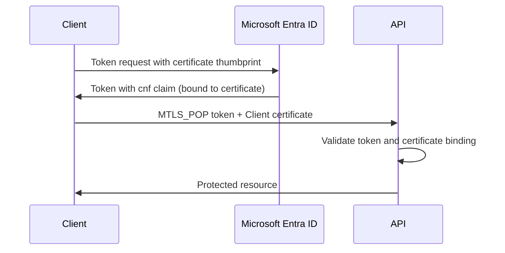

<!-- Source: https://learn.microsoft.com/en-us/entra/msidweb/call-downstream-apis/token-binding -->
<!-- Sitemap-Last-Modified: 2026-04-29 -->

# Configure token binding with mTLS Proof-of-Possession \(mTLS PoP\)

Note

Not all clients are allowed to obtain mTLS PoP certificates because this feature is currently in private preview.

Certificate token binding \(also known as mTLS PoP - Mutual TLS Proof-of-Possession\) is an advanced security feature that cryptographically binds access tokens to a specific X.509 certificate. [RFC 8705](https://datatracker.ietf.org/doc/html/rfc8705) describes this binding. The binding ensures that even if a token is intercepted, an attacker can't use it without possession of the corresponding private key.

### Understand how token binding works

The following steps describe the token binding flow from acquisition through verification.

1. **Token Acquisition**: When requesting an access token with token binding enabled, Microsoft Identity Web includes the certificate's thumbprint in the token request
2. **Token Binding**: The authorization server embeds a `cnf` \(confirmation\) claim in the issued token containing the certificate's SHA-256 thumbprint \(`x5t#S256`\)
3. **API Call**: The client presents both the bound token and the certificate when calling the downstream API
4. **Verification**: The API validates that the certificate presented matches the certificate reference in the token's `cnf` claim



### Review security benefits

Token binding provides the following advantages for securing your applications.

- **Token Theft Protection**: Stolen tokens are useless without the corresponding certificate
- **Replay Attack Prevention**: Tokens cannot be replayed from different clients
- **Enhanced Authentication**: Combines "something you have" \(certificate\) with traditional OAuth2 flows
- **Zero Trust Architecture**: Aligns with zero trust principles by binding credentials to specific devices

## Configure token binding

Set up both the client application and the API server to enable mTLS PoP token binding.

### Configure the client application

Complete the following steps to configure the client application for token binding.

#### 1. Configure Microsoft Entra ID settings

In your `appsettings.json`, configure your Microsoft Entra settings including the certificate:

```json
{
  "AzureAd": {
    "Instance": "https://login.microsoftonline.com/",
    "TenantId": "your-tenant-id",
    "ClientId": "your-client-id",
    "ClientCredentials": [
      {
        "SourceType": "StoreWithDistinguishedName",
        "CertificateStorePath": "CurrentUser/My",
        "CertificateDistinguishedName": "CN=YourCertificate"
      }
    ],
    "SendX5c": true
  }
}
```

#### 2. Configure downstream API with token binding

Configure your downstream API section with the `MTLS_POP` protocol scheme:

```json
{
  "DownstreamApi": {
    "BaseUrl": "https://api.contoso.com/",
    "RelativePath": "api/data",
    "ProtocolScheme": "MTLS_POP",
    "RequestAppToken": true,
    "Scopes": [ "api://your-api-scope/.default" ]
  }
}
```

**Important Configuration Properties:**

- `ProtocolScheme`: Must be set to `"MTLS_POP"` to enable token binding
- `RequestAppToken`: Must be `true` \(token binding currently supports only application tokens\)
- `Scopes`: API scopes required for the downstream API call

#### 3. Register services

Register the downstream API service in your application's startup code. The following example shows both console app and ASP.NET Core approaches.

```csharp
using Microsoft.Identity.Web;

var builder = WebApplication.CreateBuilder(args);

// Option 1: Using TokenAcquirerFactory (for console apps, background services)
var tokenAcquirerFactory = TokenAcquirerFactory.GetDefaultInstance();

tokenAcquirerFactory.Services.AddDownstreamApi(
    "DownstreamApi",
    tokenAcquirerFactory.Configuration.GetSection("DownstreamApi"));

var serviceProvider = tokenAcquirerFactory.Build();

// Option 2: Using ASP.NET Core DI (for web apps, web APIs)
builder.Services.AddAuthentication()
    .AddMicrosoftIdentityWebApp(builder.Configuration.GetSection("AzureAd"));

builder.Services.AddDownstreamApi(
    "DownstreamApi",
    builder.Configuration.GetSection("DownstreamApi"));
```

### Configure the API server

The downstream API must validate both the token and the certificate binding. Here's a complete example:

#### 1. Register authentication handlers

```csharp
using Microsoft.Identity.Web;

var builder = WebApplication.CreateBuilder(args);

// Add standard JWT Bearer authentication
builder.Services.AddMicrosoftIdentityWebApiAuthentication(builder.Configuration);

// Add custom MTLS_POP authentication handler
builder.Services.AddAuthentication()
    .AddScheme<AuthenticationSchemeOptions, MtlsPopAuthenticationHandler>(
        "MTLS_POP",
        options => { });

var app = builder.Build();

app.UseAuthentication();
app.UseAuthorization();

app.MapControllers();
app.Run();
```

#### 2. Implement mTLS PoP authentication handler

```csharp
using System.Security.Claims;
using System.Security.Cryptography;
using System.Security.Cryptography.X509Certificates;
using System.Text.Encodings.Web;
using System.Text.Json;
using Microsoft.AspNetCore.Authentication;
using Microsoft.Extensions.Options;
using Microsoft.IdentityModel.JsonWebTokens;
using Microsoft.IdentityModel.Tokens;

public class MtlsPopAuthenticationHandler : AuthenticationHandler<AuthenticationSchemeOptions>
{
    public const string ProtocolScheme = "MTLS_POP";

    public MtlsPopAuthenticationHandler(
        IOptionsMonitor<AuthenticationSchemeOptions> options,
        ILoggerFactory logger,
        UrlEncoder encoder)
        : base(options, logger, encoder)
    {
    }

    protected override async Task<AuthenticateResult> HandleAuthenticateAsync()
    {
        // 1. Extract the MTLS_POP authorization header
        var authHeader = Request.Headers.Authorization.FirstOrDefault();
        if (string.IsNullOrEmpty(authHeader) ||
            !authHeader.StartsWith($"{ProtocolScheme} ", StringComparison.OrdinalIgnoreCase))
        {
            return AuthenticateResult.NoResult();
        }

        var authToken = authHeader.Substring($"{ProtocolScheme} ".Length).Trim();

        try
        {
            // 2. Parse the JWT token
            var handler = new JsonWebTokenHandler();
            var token = handler.ReadJsonWebToken(authToken);

            // 3. Extract the 'cnf' claim
            var cnfClaim = token.Claims.FirstOrDefault(c => c.Type == "cnf");
            if (cnfClaim == null)
            {
                return AuthenticateResult.Fail("Missing 'cnf' claim in MTLS_POP token");
            }

            // 4. Extract certificate thumbprint from cnf claim
            var cnfJson = JsonDocument.Parse(cnfClaim.Value);
            if (!cnfJson.RootElement.TryGetProperty("x5t#S256", out var x5tS256Element))
            {
                return AuthenticateResult.Fail("Missing 'x5t#S256' in cnf claim");
            }

            var expectedThumbprint = x5tS256Element.GetString();

            // 5. Get client certificate from TLS connection
            var clientCert = Context.Connection.ClientCertificate;
            if (clientCert != null)
            {
                var actualThumbprint = GetCertificateThumbprint(clientCert);

                // 6. Validate certificate binding
                if (!string.Equals(actualThumbprint, expectedThumbprint,
                    StringComparison.OrdinalIgnoreCase))
                {
                    return AuthenticateResult.Fail(
                        "Certificate thumbprint mismatch with cnf claim");
                }
            }

            // 7. Create claims principal
            var claims = token.Claims.Select(c => new Claim(c.Type, c.Value)).ToList();
            var identity = new ClaimsIdentity(claims, ProtocolScheme);
            var principal = new ClaimsPrincipal(identity);
            var ticket = new AuthenticationTicket(principal, ProtocolScheme);

            return AuthenticateResult.Success(ticket);
        }
        catch (Exception ex)
        {
            Logger.LogError(ex, "Error validating mTLS PoP token");
            return AuthenticateResult.Fail($"Validation error: {ex.Message}");
        }
    }

    private static string GetCertificateThumbprint(X509Certificate2 certificate)
    {
        using var sha256 = SHA256.Create();
        var hash = sha256.ComputeHash(certificate.RawData);
        return Base64UrlEncoder.Encode(hash);
    }
}
```

## Use token binding in applications

The following examples show how to integrate mTLS PoP token binding in different application types.

### Call APIs from a console or daemon application

The following example demonstrates a console or daemon application that calls a downstream API with mTLS PoP token binding.

```csharp
using Microsoft.Extensions.DependencyInjection;
using Microsoft.Identity.Abstractions;
using Microsoft.Identity.Web;

public class Program
{
    public static async Task Main(string[] args)
    {
        // Create and configure token acquirer
        var tokenAcquirerFactory = TokenAcquirerFactory.GetDefaultInstance();

        tokenAcquirerFactory.Services.AddDownstreamApi(
            "SecureApi",
            tokenAcquirerFactory.Configuration.GetSection("SecureApi"));

        var serviceProvider = tokenAcquirerFactory.Build();

        // Get IDownstreamApi instance
        var downstreamApi = serviceProvider.GetRequiredService<IDownstreamApi>();

        // Call API with mTLS PoP token
        var response = await downstreamApi.GetForAppAsync<ApiResponse>("SecureApi");

        Console.WriteLine($"Result: {response?.Data}");
    }
}

public class ApiResponse
{
    public string? Data { get; set; }
}
```

### Call APIs from an ASP.NET Core web application

The following example shows a controller that calls a downstream API with mTLS PoP token binding.

```csharp
using Microsoft.AspNetCore.Mvc;
using Microsoft.Identity.Abstractions;

[ApiController]
[Route("api/[controller]")]
public class DataController : ControllerBase
{
    private readonly IDownstreamApi _downstreamApi;
    private readonly ILogger<DataController> _logger;

    public DataController(
        IDownstreamApi downstreamApi,
        ILogger<DataController> logger)
    {
        _downstreamApi = downstreamApi;
        _logger = logger;
    }

    [HttpGet]
    public async Task<IActionResult> GetSecureData()
    {
        try
        {
            // Call downstream API with mTLS PoP token binding
            var data = await _downstreamApi.GetForAppAsync<SecureData>(
                "SecureApi");

            return Ok(data);
        }
        catch (Exception ex)
        {
            _logger.LogError(ex, "Failed to retrieve secure data");
            return StatusCode(500, "Failed to retrieve data");
        }
    }
}

public class SecureData
{
    public string? Id { get; set; }
    public string? Value { get; set; }
}
```

### Configure DownstreamApiOptions programmatically

The following example sets mTLS PoP options directly in code instead of configuration files.

```csharp
using Microsoft.Identity.Abstractions;
using Microsoft.Identity.Web;

public class SecureApiService
{
    private readonly IDownstreamApi _downstreamApi;

    public SecureApiService(IDownstreamApi downstreamApi)
    {
        _downstreamApi = downstreamApi;
    }

    public async Task<T?> CallSecureApiAsync<T>(string endpoint) where T : class
    {
        return await _downstreamApi.GetForAppAsync<T>(
            serviceName: null,
            downstreamApiOptionsOverride: options =>
            {
                options.BaseUrl = "https://api.secure.com";
                options.RelativePath = endpoint;
                options.ProtocolScheme = "MTLS_POP";
                options.RequestAppToken = true;
                options.Scopes = new[] { "api://secure-api/.default" };
            });
    }
}
```

### Use MicrosoftIdentityMessageHandler with token binding

`MicrosoftIdentityMessageHandler` supports mTLS PoP token binding through the `AddMicrosoftIdentityMessageHandler` extension methods. When `ProtocolScheme` is set to `"MTLS_POP"`, the handler automatically acquires a bound token and sends requests through an mTLS-configured HTTP client.

#### Configure inline options

The following example registers an HTTP client with inline mTLS PoP configuration and shows its usage in a service.

```csharp
// Program.cs
services.AddHttpClient("MtlsPopClient", client =>
{
    client.BaseAddress = new Uri("https://api.contoso.com");
})
.AddMicrosoftIdentityMessageHandler(options =>
{
    options.Scopes.Add("api://contoso/.default");
    options.ProtocolScheme = "MTLS_POP";
    options.RequestAppToken = true;
});

// Usage in a service
public class SecureApiService
{
    private readonly HttpClient _httpClient;

    public SecureApiService(IHttpClientFactory factory)
    {
        _httpClient = factory.CreateClient("MtlsPopClient");
    }

    public async Task<string> GetSecureDataAsync()
    {
        // Authentication and mTLS certificate binding are automatic
        var response = await _httpClient.GetAsync("/api/secure-data");
        response.EnsureSuccessStatusCode();
        return await response.Content.ReadAsStringAsync();
    }
}
```

#### Load configuration from appsettings.json

You can also load token binding settings from your configuration file.

**appsettings.json:**

```json
{
  "DownstreamApis": {
    "SecureApi": {
      "Scopes": ["api://secure-api/.default"],
      "ProtocolScheme": "MTLS_POP",
      "RequestAppToken": true
    }
  }
}
```

**Program.cs**: The following code registers the HTTP client using the configuration section.

```csharp
services.AddHttpClient("SecureApiClient", client =>
{
    client.BaseAddress = new Uri("https://secure-api.example.com");
})
.AddMicrosoftIdentityMessageHandler(
    configuration.GetSection("DownstreamApis:SecureApi"),
    "SecureApi");
```

#### Apply per-request token binding

Use per-request options when some requests need token binding and others do not:

```csharp
services.AddHttpClient("FlexibleClient")
    .AddMicrosoftIdentityMessageHandler();

// In a service:
public async Task<string> CallWithTokenBindingAsync()
{
    var request = new HttpRequestMessage(HttpMethod.Get, "https://api.contoso.com/secure")
        .WithAuthenticationOptions(options =>
        {
            options.Scopes.Add("api://contoso/.default");
            options.ProtocolScheme = "MTLS_POP";
            options.RequestAppToken = true;
        });

    var response = await _httpClient.SendAsync(request);
    response.EnsureSuccessStatusCode();
    return await response.Content.ReadAsStringAsync();
}
```

For more information about `MicrosoftIdentityMessageHandler`, see [Custom APIs documentation](https://learn.microsoft.com/en-us/entra/msidweb/call-downstream-apis/custom-apis#use-microsoftidentitymessagehandler-for-httpclient-integration).

### Create a custom HttpClient with authorization header provider

Use this approach for scenarios that require more control over HTTP requests. The following example acquires a bound authorization header and creates an mTLS-configured HTTP client.

```csharp
using Microsoft.Identity.Abstractions;
using System.Net.Http.Headers;

public class CustomApiClient
{
    private readonly IAuthorizationHeaderProvider _authProvider;
    private readonly IHttpClientFactory _httpClientFactory;

    public CustomApiClient(
        IAuthorizationHeaderProvider authProvider,
        IHttpClientFactory httpClientFactory)
    {
        _authProvider = authProvider;
        _httpClientFactory = httpClientFactory;
    }

    public async Task<string> CallApiWithCustomLogicAsync()
    {
        // Create downstream API options for mTLS PoP
        var apiOptions = new DownstreamApiOptions
        {
            BaseUrl = "https://api.contoso.com",
            ProtocolScheme = "MTLS_POP",
            RequestAppToken = true,
            Scopes = new[] { "api://contoso/.default" }
        };

        // Get authorization header with binding certificate info
        var authResult = await (_authProvider as IBoundAuthorizationHeaderProvider)
            ?.CreateBoundAuthorizationHeaderAsync(apiOptions)!;

        if (authResult.IsSuccess)
        {
            // Create HTTP client with certificate binding
            var httpClient = authResult.Value.BindingCertificate != null
                ? CreateMtlsHttpClient(authResult.Value.BindingCertificate)
                : _httpClientFactory.CreateClient();

            // Set authorization header
            httpClient.DefaultRequestHeaders.Authorization =
                AuthenticationHeaderValue.Parse(authResult.Value.AuthorizationHeaderValue);

            // Make API call
            var response = await httpClient.GetAsync(
                $"{apiOptions.BaseUrl}/api/endpoint");

            return await response.Content.ReadAsStringAsync();
        }

        throw new InvalidOperationException("Failed to acquire token");
    }

    private HttpClient CreateMtlsHttpClient(X509Certificate2 certificate)
    {
        var handler = new HttpClientHandler();
        handler.ClientCertificates.Add(certificate);
        return new HttpClient(handler);
    }
}
```

## Examine token structure

The following examples show how standard and bound tokens differ.

### Compare standard OAuth2 tokens

A standard OAuth2 token contains no certificate binding information.

```json
{
  "aud": "api://your-api",
  "iss": "https://login.microsoftonline.com/tenant-id/",
  "iat": 1234567890,
  "exp": 1234571490,
  "appid": "client-id",
  "tid": "tenant-id"
}
```

### Review mTLS PoP tokens with binding

An mTLS PoP token includes the `cnf` claim that binds the token to a specific certificate.

```json
{
  "aud": "api://your-api",
  "iss": "https://login.microsoftonline.com/tenant-id/",
  "iat": 1234567890,
  "exp": 1234571490,
  "appid": "client-id",
  "tid": "tenant-id",
  "cnf": {
    "x5t#S256": "buc7x2HxS_hPnVJb9J5mwPr6jCw8Y_2LHDz-gp_-6KM"
  }
}
```

The `cnf` \(confirmation\) claim contains the SHA-256 thumbprint of the certificate, Base64Url-encoded.

## Understand current limitations

Review the following constraints before you implement mTLS PoP token binding.

### Support application tokens only

Token binding currently supports **only application \(app-only\) tokens**. Delegated \(user\) tokens are not supported.

### Set the protocol scheme

The `ProtocolScheme` property must be explicitly set to `"MTLS_POP"` to enable token binding. If not set, standard Bearer authentication is used.

### Meet certificate requirements

- The certificate must be configured in `ClientCredentials` with `SendX5c` set to `true`
- The certificate must be accessible at token acquisition time

## Troubleshoot common issues

Use the following guidance to diagnose and resolve token binding problems.

### Resolve common issues

#### 1. "Missing 'cnf' claim in token"

**Cause**: Token binding was not properly configured or the token is a standard Bearer token.

**Solution**: Verify that `ProtocolScheme` is set to `"MTLS_POP"` and `RequestAppToken` is `true`.

```json
{
  "DownstreamApi": {
    "ProtocolScheme": "MTLS_POP",  // ensure this is set
    "RequestAppToken": true
  }
}
```

#### 2. "Certificate thumbprint mismatch"

**Cause**: The certificate presented to the API doesn't match the one used for token acquisition.

**Solution**:

- Verify the same certificate is used for both token acquisition and API calls
- Check certificate loading configuration in `ClientCredentials`
- Ensure certificate is not expired or renewed

#### 3. "A certificate, which is required for token binding, is missing"

**Cause**: No certificate is configured in Microsoft Entra settings.

**Solution**: Add a certificate to your `ClientCredentials` configuration and set `SendX5c` to `true`.

```json
{
  "AzureAd": {
    "ClientCredentials": [
      {
        "SourceType": "StoreWithDistinguishedName",
        "CertificateStorePath": "CurrentUser/My",
        "CertificateDistinguishedName": "CN=YourCertificate"
      }
    ],
    "SendX5c": true  // required for token binding
  }
}
```

#### 4. "Token binding requires enabled app token acquisition"

**Cause**: `RequestAppToken` is not set to `true`.

**Solution**: Set `RequestAppToken` to `true` in your options.

```csharp
var options = new DownstreamApiOptions
{
    ProtocolScheme = "MTLS_POP",
    RequestAppToken = true,  // must be true
};
```

### Debug token binding

Use the following techniques to investigate token binding issues.

#### Enable detailed logging

Add the following configuration to enable debug-level logging for Microsoft.Identity.Web.

```json
{
  "Logging": {
    "LogLevel": {
      "Default": "Information",
      "Microsoft.Identity.Web": "Debug"
    }
  }
}
```

#### Inspect token claims

Use the following code to list all claims in a token and check for the `cnf` claim.

```csharp
var handler = new JsonWebTokenHandler();
var token = handler.ReadJsonWebToken(tokenString);

foreach (var claim in token.Claims)
{
    Console.WriteLine($"{claim.Type}: {claim.Value}");
}

// Look for 'cnf' claim with x5t#S256
var cnfClaim = token.Claims.FirstOrDefault(c => c.Type == "cnf");
```

#### Verify certificate thumbprint

Use the following code to compute and display a certificate's SHA-256 thumbprint for comparison.

```csharp
using System.Security.Cryptography;
using System.Security.Cryptography.X509Certificates;
using Microsoft.IdentityModel.Tokens;

var cert = new X509Certificate2("path/to/cert.pfx", "password");
using var sha256 = SHA256.Create();
var hash = sha256.ComputeHash(cert.RawData);
var thumbprint = Base64UrlEncoder.Encode(hash);
Console.WriteLine($"Certificate thumbprint: {thumbprint}");
```

## Follow security guidelines

Apply the following security practices when you implement token binding.

### Manage certificates securely

- **Store securely**: Use Azure Key Vault or secure certificate stores
- **Rotate regularly**: Implement certificate rotation procedures
- **Monitor expiration**: Set up alerts for certificate expiration
- **Restrict access**: Limit who can access certificate private keys

### Secure network connections

- **Require TLS 1.2+**: Ensure all connections use modern TLS versions
- **Validate certificates**: Implement proper certificate validation on the server
- **Use strong ciphers**: Configure secure cipher suites

### Handle tokens securely

- **Short lifetimes**: Use short-lived tokens \(recommended: 1 hour\)
- **Proper storage**: Never log or expose tokens
- **Validate thoroughly**: Check all claims, expiration, and binding

## Follow best practices

Keep the following recommendations in mind when you deploy mTLS PoP token binding.

1. **Always use HTTPS**: mTLS PoP requires secure transport
2. **Use a certificate that stores the private key material in hardware, e.g., in TPM**: Use hardware over software security for better protection
3. **Implement proper error handling**: Gracefully handle certificate and token errors
4. **Monitor certificate expiration**: Automate certificate renewal
5. **Use separate certificates per environment**: Dev, staging, and production certificates
6. **Log security events**: Track token binding failures and certificate mismatches
7. **Test certificate rotation**: Ensure your application handles certificate updates
8. **Document your configuration**: Keep clear documentation of certificate requirements

## Related content

- [Microsoft Identity Web Documentation](https://learn.microsoft.com/en-us/entra/msidweb/overview)
- [Calling Downstream APIs Overview](https://learn.microsoft.com/en-us/entra/msidweb/call-downstream-apis/overview)
- [Custom APIs Documentation](https://learn.microsoft.com/en-us/entra/msidweb/call-downstream-apis/custom-apis)
- [Microsoft Entra Certificate Credentials](https://learn.microsoft.com/en-us/entra/identity-platform/certificate-credentials)
- [OAuth 2.0 Mutual-TLS Client Authentication](https://datatracker.ietf.org/doc/html/rfc8705)

## Explore sample code

Complete working samples demonstrating mTLS PoP token binding are available in the repository:

- **Client Application**: [`tests/DevApps/MtlsPop/MtlsPopClient`](https://github.com/AzureAD/microsoft-identity-web/tree/master/tests/DevApps/MtlsPop/MtlsPopClient)
- **Web API Server**: [`tests/DevApps/MtlsPop/MtlsPopWebApi`](https://github.com/AzureAD/microsoft-identity-web/tree/master/tests/DevApps/MtlsPop/MtlsPopWebApi)

These samples demonstrate:

- Complete client and server configuration
- Token acquisition with certificate binding
- Custom authentication handler implementation
- Certificate validation and thumbprint verification
