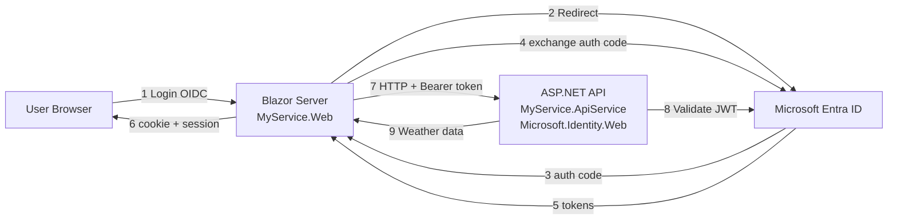

<!-- Source: https://learn.microsoft.com/en-us/entra/msidweb/frameworks/aspire -->
<!-- Sitemap-Last-Modified: 2026-04-29 -->

# Add Microsoft Entra ID authentication to a .NET Aspire app

This guide shows how to secure a **.NET Aspire** distributed application with **Microsoft Entra ID** authentication and authorization. It covers:

1. **Blazor Server frontend** \(`MyService.Web`\): User sign-in with OpenID Connect and token acquisition
2. **Protected API backend** \(`MyService.ApiService`\): JWT validation using **Microsoft.Identity.Web**
3. **End-to-end flow**: Blazor acquires access tokens and calls the protected API with Aspire service discovery

This guide assumes you started with an Aspire project created by using the following command:

```sh
aspire new aspire-starter --name MyService
```

## Prerequisites

- **.NET 9 SDK** or later
- **.NET Aspire CLI** - See [Install Aspire CLI](https://aspire.dev/get-started/install-cli/)
- **Microsoft Entra tenant** — See [Register apps in Microsoft Entra ID](#register-apps-in-microsoft-entra-id) for setup

Tip

New to Aspire? See [.NET Aspire overview](https://learn.microsoft.com/en-us/dotnet/aspire/get-started/aspire-overview).

## Understand the two-phase workflow

This guide follows a two-phase approach:

| Phase | What happens | Result |
| --- | --- | --- |
| **Phase 1** | Add authentication code with placeholder values | App builds but won't run |
| **Phase 2** | Provision Microsoft Entra app registrations | App runs with real authentication |

## Register apps in Microsoft Entra ID

Before your app can authenticate users, you need two app registrations in Microsoft Entra:

| App Registration | Purpose | Key configuration |
| --- | --- | --- |
| **API** \(`MyService.ApiService`\) | Validates incoming tokens | App ID URI, `access_as_user` scope |
| **Web App** \(`MyService.Web`\) | Signs in users, acquires tokens | Redirect URIs, client secret, API permissions |

If you already have app registrations configured, you need these values for your `appsettings.json`:

- **TenantId** — Your Microsoft Entra tenant ID
- **API ClientId** — Application \(client\) ID of your API app registration
- **API App ID URI** — Usually `api://<api-client-id>` \(used in `Audiences` and `Scopes`\)
- **Web App ClientId** — Application \(client\) ID of your web app registration
- **Client Secret** \(or certificate\) — Credential for the web app \(store in user-secrets, not appsettings.json\)
- **Scopes** — The scope\(s\) your web app requests, for example, `api://<api-client-id>/.default` or `api://<api-client-id>/access_as_user`

### Step 1: Register the API

1. Go to [Microsoft Entra admin center](https://entra.microsoft.com) > **Identity** > **Applications** > **App registrations**.
2. Select **New registration**.

   - **Name:** `MyService.ApiService`
   - **Supported account types:** Accounts in this organizational directory only \(Single tenant\)
   - Select **Register**.

3. Go to **Expose an API** > **Add** next to Application ID URI.

   - Accept the default \(`api://<client-id>`\) or customize it.
   - Select **Add a scope**:

     - **Scope name:** `access_as_user`
     - **Who can consent:** Admins and users
     - **Admin consent display name:** Access MyService API
     - **Admin consent description:** Allows the app to access MyService API on behalf of the signed-in user.
     - Select **Add scope**.

4. Copy the **Application \(client\) ID** — you'll need this for both `appsettings.json` files.

For more information, see [Quickstart: Configure an app to expose a web API](https://learn.microsoft.com/en-us/entra/identity-platform/quickstart-configure-app-expose-web-apis).

### Step 2: Register the web app

1. Go to **App registrations** > **New registration**.

   - **Name:** `MyService.Web`
   - **Supported account types:** Accounts in this organizational directory only
   - **Redirect URI:** Select **Web** and enter your app's URL + `/signin-oidc`

     - For local development: `https://localhost:7001/signin-oidc` \(check your `launchSettings.json` for the actual port\)

   - Select **Register**.

2. Go to **Authentication** > **Add URI** to add all your development URLs \(from `launchSettings.json`\).
3. Go to **Certificates & secrets** > **Client secrets** > **New client secret**.

   - Add a description and expiration.
   - Copy the secret value immediately — it won't be shown again.

4. Go to **API permissions** > **Add a permission** > **My APIs**.

   - Select `MyService.ApiService`.
   - Select `access_as_user` > **Add permissions**.
   - Select **Grant admin consent for \[tenant\]** \(or users are prompted at first use\).

5. Copy the **Application \(client\) ID** for the web app's `appsettings.json`.

Note

Some organizations don't allow client secrets. For alternatives, see [Certificate credentials](https://learn.microsoft.com/en-us/entra/msidweb/authentication/certificates) or [Certificateless authentication](https://learn.microsoft.com/en-us/entra/msidweb/authentication/certificateless).

For more information, see [Quickstart: Register an application](https://learn.microsoft.com/en-us/entra/identity-platform/quickstart-register-app).

### Step 3: Update configuration

After creating the app registrations, update your `appsettings.json` files:

**API \(`MyService.ApiService/appsettings.json`\):**

```json
{
  "AzureAd": {
    "Instance": "https://login.microsoftonline.com/",
    "TenantId": "YOUR_TENANT_ID",
    "ClientId": "YOUR_API_CLIENT_ID",
    "Audiences": ["api://YOUR_API_CLIENT_ID"]
  }
}
```

**Web App \(`MyService.Web/appsettings.json`\):**

```json
{
  "AzureAd": {
    "Instance": "https://login.microsoftonline.com/",
    "TenantId": "YOUR_TENANT_ID",
    "ClientId": "YOUR_WEB_CLIENT_ID",
    "CallbackPath": "/signin-oidc",
    "ClientCredentials": [
      { "SourceType": "ClientSecret" }
    ]
  },
  "WeatherApi": {
    "Scopes": ["api://YOUR_API_CLIENT_ID/.default"]
  }
}
```

**Store the secret securely:**

```powershell
cd MyService.Web
dotnet user-secrets set "AzureAd:ClientCredentials:0:ClientSecret" "YOUR_SECRET_VALUE"
```

| Value | Where to find |
| --- | --- |
| `TenantId` | Microsoft Entra admin center > Overview > Tenant ID |
| `API ClientId` | App registrations > MyService.ApiService > Application \(client\) ID |
| `Web ClientId` | App registrations > MyService.Web > Application \(client\) ID |
| `Client Secret` | Created in Step 2 \(copy immediately when created\) |

Note

The Aspire starter template automatically creates a `WeatherApiClient` class in the `MyService.Web` project. This typed HttpClient is used throughout this guide to demonstrate calling the protected API. You don't need to create this class yourself — it's part of the template.

---

## Get started quickly

This section provides a condensed reference for adding authentication. For detailed walkthroughs, see [Part 1](#part-1-secure-the-api-backend-with-microsoftidentityweb) and [Part 2](#part-2-configure-blazor-frontend-for-authentication).

### API \(`MyService.ApiService`\)

Install the Microsoft.Identity.Web NuGet package:

```powershell
dotnet add package Microsoft.Identity.Web
```

Add the Microsoft Entra configuration to `appsettings.json`:

```json
{
  "AzureAd": {
    "Instance": "https://login.microsoftonline.com/",
    "TenantId": "<tenant-id>",
    "ClientId": "<api-client-id>",
    "Audiences": ["api://<api-client-id>"]
  }
}
```

Register authentication and authorization in `Program.cs`:

```csharp
builder.Services.AddAuthentication(JwtBearerDefaults.AuthenticationScheme)
    .AddMicrosoftIdentityWebApi(builder.Configuration.GetSection("AzureAd"));
builder.Services.AddAuthorization();
// ...
app.UseAuthentication();
app.UseAuthorization();
// ...
app.MapGet("/weatherforecast", () => { /* ... */ }).RequireAuthorization();
```

### Web App \(`MyService.Web`\)

Install the Microsoft.Identity.Web NuGet package:

```powershell
dotnet add package Microsoft.Identity.Web
```

Add the Microsoft Entra configuration to `appsettings.json`:

```json
{
  "AzureAd": {
    "Instance": "https://login.microsoftonline.com/",
    "TenantId": "<tenant-id>",
    "ClientId": "<web-client-id>",
    "CallbackPath": "/signin-oidc",
    "ClientCredentials": [{ "SourceType": "ClientSecret" }]
  },
  "WeatherApi": { "Scopes": ["api://<api-client-id>/.default"] }
}
```

Configure authentication, token acquisition, and the downstream API client in `Program.cs`:

```csharp
builder.Services.AddAuthentication(OpenIdConnectDefaults.AuthenticationScheme)
    .AddMicrosoftIdentityWebApp(builder.Configuration.GetSection("AzureAd"))
    .EnableTokenAcquisitionToCallDownstreamApi()
    .AddInMemoryTokenCaches();

builder.Services.AddCascadingAuthenticationState();
builder.Services.AddScoped<BlazorAuthenticationChallengeHandler>();

builder.Services.AddHttpClient<WeatherApiClient>(client =>
    client.BaseAddress = new("https+http://apiservice"))
    .AddMicrosoftIdentityMessageHandler(builder.Configuration.GetSection("WeatherApi"));
// ...
app.UseAuthentication();
app.UseAuthorization();
app.MapGroup("/authentication").MapLoginAndLogout();
```

The `MicrosoftIdentityMessageHandler` automatically acquires and attaches tokens, and `BlazorAuthenticationChallengeHandler` handles consent and Conditional Access challenges.

Important

Don't forget to create `UserInfo.razor` for the login button. See [Add Blazor UI components](#add-blazor-ui-components) for details.

Note

`BlazorAuthenticationChallengeHandler` and `LoginLogoutEndpointRouteBuilderExtensions` ship in Microsoft.Identity.Web \(v3.3.0+\). No file copying is required.

---

## Identify files to modify

The following table lists the files you change in each project:

| Project | File | Changes |
| --- | --- | --- |
| **ApiService** | `Program.cs` | JWT Bearer auth, authorization middleware |
|  | `appsettings.json` | Microsoft Entra configuration |
|  | `.csproj` | Add `Microsoft.Identity.Web` |
| **Web** | `Program.cs` | OIDC auth, token acquisition, BlazorAuthenticationChallengeHandler |
|  | `appsettings.json` | Microsoft Entra config, downstream API scopes |
|  | `.csproj` | Add `Microsoft.Identity.Web` \(v3.3.0+\) |
|  | `Components/UserInfo.razor` | Login button UI \(new file\) |
|  | `Components/Layout/MainLayout.razor` | Include UserInfo component |
|  | `Components/Routes.razor` | AuthorizeRouteView for protected pages |
|  | Pages calling APIs | Try/catch with ChallengeHandler |

---

## Understand the authentication flow

The following diagram shows how the Blazor frontend, Microsoft Entra, and the protected API interact:



1. **User visits Blazor app** → Not authenticated → sees "Login" button.
2. **User selects Login** → Redirects to `/authentication/login` → OIDC challenge → Microsoft Entra.
3. **User signs in** → Microsoft Entra redirects to `/signin-oidc` → cookie established.
4. **User navigates to Weather page** → Blazor calls `WeatherApiClient.GetAsync()`.
5. **`MicrosoftIdentityMessageHandler`** intercepts the request, acquires a token from cache \(or silently refreshes\), and attaches the `Authorization: Bearer <token>` header.
6. **API receives request** → Microsoft.Identity.Web validates the JWT → returns data.
7. **Blazor renders weather data**.

## Review the solution structure

The Aspire starter template creates the following project layout:

```
MyService/
├── MyService.AppHost/           # Aspire orchestration
├── MyService.ApiService/        # Protected API (Microsoft.Identity.Web)
├── MyService.Web/               # Blazor Server (Microsoft.Identity.Web)
├── MyService.ServiceDefaults/   # Shared defaults
└── MyService.Tests/             # Tests
```

---

## Part 1: Secure the API backend with Microsoft.Identity.Web

This section configures the API project to validate JWT Bearer tokens issued by Microsoft Entra.

### Add Microsoft.Identity.Web package

Run the following command to install the Microsoft.Identity.Web NuGet package:

```powershell
cd MyService.ApiService
dotnet add package Microsoft.Identity.Web
```

### Configure Microsoft Entra settings

Add the Microsoft Entra configuration to `MyService.ApiService/appsettings.json`:

```json
{
  "AzureAd": {
    "Instance": "https://login.microsoftonline.com/",
    "TenantId": "<your-tenant-id>",
    "ClientId": "<your-api-client-id>",
    "Audiences": [
      "api://<your-api-client-id>"
    ]
  },
  "Logging": {
    "LogLevel": {
      "Default": "Information",
      "Microsoft.AspNetCore": "Warning"
    }
  },
  "AllowedHosts": "*"
}
```

Key properties:

- **`ClientId`**: Microsoft Entra API app registration ID
- **`TenantId`**: Your Microsoft Entra tenant ID, or `"organizations"` for multi-tenant, or `"common"` for any Microsoft account
- **`Audiences`**: Valid token audiences \(typically your App ID URI\)

### Update API Program.cs

Replace the contents of `MyService.ApiService/Program.cs` with the following code to add JWT Bearer authentication and protect endpoints:

```csharp
using Microsoft.AspNetCore.Authentication.JwtBearer;
using Microsoft.Identity.Web;

var builder = WebApplication.CreateBuilder(args);

builder.AddServiceDefaults();

// Add Microsoft.Identity.Web JWT Bearer authentication
builder.Services.AddAuthentication(JwtBearerDefaults.AuthenticationScheme)
    .AddMicrosoftIdentityWebApi(builder.Configuration.GetSection("AzureAd"));

builder.Services.AddProblemDetails();
builder.Services.AddOpenApi();
builder.Services.AddAuthorization();

var app = builder.Build();

app.UseExceptionHandler();
app.UseAuthentication();
app.UseAuthorization();

if (app.Environment.IsDevelopment())
{
    app.MapOpenApi();
}

string[] summaries = ["Freezing", "Bracing", "Chilly", "Cool", "Mild",
    "Warm", "Balmy", "Hot", "Sweltering", "Scorching"];

app.MapGet("/", () =>
    "API service is running. Navigate to /weatherforecast to see sample data.");

app.MapGet("/weatherforecast", () =>
{
    var forecast = Enumerable.Range(1, 5).Select(index =>
        new WeatherForecast
        (
            DateOnly.FromDateTime(DateTime.Now.AddDays(index)),
            Random.Shared.Next(-20, 55),
            summaries[Random.Shared.Next(summaries.Length)]
        ))
        .ToArray();
    return forecast;
})
.WithName("GetWeatherForecast")
.RequireAuthorization();

app.MapDefaultEndpoints();
app.Run();

record WeatherForecast(DateOnly Date, int TemperatureC, string? Summary)
{
    public int TemperatureF => 32 + (int)(TemperatureC / 0.5556);
}
```

Key changes:

- Register JWT Bearer authentication with `AddMicrosoftIdentityWebApi`
- Add `app.UseAuthentication()` and `app.UseAuthorization()` middleware
- Apply `.RequireAuthorization()` to protected endpoints

### Test the protected API

Verify the API rejects unauthenticated requests and accepts valid tokens.

Send a request without a token:

```powershell
curl https://localhost:<PORT>/weatherforecast
# Expected: 401 Unauthorized
```

Send a request with a valid token:

```powershell
curl -H "Authorization: Bearer <TOKEN>" https://localhost:<PORT>/weatherforecast
# Expected: 200 OK with weather data
```

---

## Part 2: Configure Blazor frontend for authentication

The Blazor Server app uses **Microsoft.Identity.Web** to:

- Sign users in with OIDC
- Acquire access tokens to call the API
- Attach tokens to outgoing HTTP requests

### Add Microsoft.Identity.Web package

Run the following command to install the Microsoft.Identity.Web NuGet package:

```powershell
cd MyService.Web
dotnet add package Microsoft.Identity.Web
```

### Configure Microsoft Entra settings

Add the Microsoft Entra configuration and downstream API scopes to `MyService.Web/appsettings.json`:

```json
{
  "AzureAd": {
    "Instance": "https://login.microsoftonline.com/",
    "Domain": "<your-tenant>.onmicrosoft.com",
    "TenantId": "<tenant-guid>",
    "ClientId":  "<web-app-client-id>",
    "CallbackPath": "/signin-oidc",
    "ClientCredentials": [
      {
        "SourceType": "ClientSecret",
        "ClientSecret": "<your-client-secret>"
      }
    ]
  },
  "WeatherApi": {
    "Scopes": [ "api://<api-client-id>/.default" ]
  },
  "Logging": {
    "LogLevel":  {
      "Default": "Information",
      "Microsoft.AspNetCore": "Warning"
    }
  },
  "AllowedHosts": "*"
}
```

Configuration details:

- **`ClientId`**: Web app registration ID \(not the API ID\)
- **`ClientCredentials`**: Credentials for the web app to acquire tokens. Supports multiple credential types. See [Credentials overview](https://learn.microsoft.com/en-us/entra/msidweb/authentication/credentials-overview) for production-ready options.
- **`Scopes`**: Must match the API's App ID URI with `/.default` suffix

Warning

For production, use certificates or managed identity instead of client secrets. See [Certificateless authentication](https://learn.microsoft.com/en-us/entra/msidweb/authentication/certificateless) for the recommended approach.

### Update web app Program.cs

Replace the contents of `MyService.Web/Program.cs` with the following code to configure OIDC authentication, token acquisition, and the downstream API client:

```csharp
using Microsoft.AspNetCore.Authentication.OpenIdConnect;
using Microsoft.Identity.Abstractions;
using Microsoft.Identity.Web;
using MyService.Web;
using MyService.Web.Components;

var builder = WebApplication.CreateBuilder(args);

builder.AddServiceDefaults();

// Authentication + Microsoft Identity Web
builder.Services.AddAuthentication(OpenIdConnectDefaults.AuthenticationScheme)
    .AddMicrosoftIdentityWebApp(builder.Configuration.GetSection("AzureAd"))
    .EnableTokenAcquisitionToCallDownstreamApi()
    .AddInMemoryTokenCaches();

builder.Services.AddCascadingAuthenticationState();

// Blazor components
builder.Services.AddRazorComponents().AddInteractiveServerComponents();

// Blazor authentication challenge handler for incremental consent and Conditional Access
builder.Services.AddScoped<BlazorAuthenticationChallengeHandler>();

builder.Services.AddOutputCache();

// Downstream API client with MicrosoftIdentityMessageHandler
builder.Services.AddHttpClient<WeatherApiClient>(client =>
{
    // Aspire service discovery: resolves "apiservice" at runtime
    client.BaseAddress = new("https+http://apiservice");
})
.AddMicrosoftIdentityMessageHandler(builder.Configuration.GetSection("WeatherApi"));

var app = builder.Build();

if (!app.Environment.IsDevelopment())
{
    app.UseExceptionHandler("/Error", createScopeForErrors: true);
    app.UseHsts();
}

app.UseHttpsRedirection();
app.UseAuthentication();
app.UseAuthorization();
app.UseAntiforgery();
app.UseOutputCache();

app.MapStaticAssets();
app.MapRazorComponents<App>()
   .AddInteractiveServerRenderMode();

// Login/Logout endpoints with incremental consent support
app.MapGroup("/authentication").MapLoginAndLogout();

app.MapDefaultEndpoints();
app.Run();
```

Key points:

- **`AddMicrosoftIdentityWebApp`**: Configures OIDC authentication
- **`EnableTokenAcquisitionToCallDownstreamApi`**: Enables token acquisition for downstream APIs
- **`AddScoped<BlazorAuthenticationChallengeHandler>`**: Handles incremental consent and Conditional Access in Blazor Server
- **`AddMicrosoftIdentityMessageHandler`**: Attaches bearer tokens to HttpClient requests automatically
- **`https+http://apiservice`**: Aspire service discovery resolves this to the actual API URL
- **Middleware order**: `UseAuthentication()` → `UseAuthorization()` → endpoints

The `AddMicrosoftIdentityMessageHandler` extension supports multiple configuration patterns:

**Option 1: Configuration from appsettings.json \(shown previously\)**

```csharp
.AddMicrosoftIdentityMessageHandler(builder.Configuration.GetSection("WeatherApi"));
```

**Option 2: Inline configuration with Action delegate**

```csharp
.AddMicrosoftIdentityMessageHandler(options =>
{
    options.Scopes.Add("api://<api-client-id>/.default");
});
```

**Option 3: Per-request configuration \(parameterless\)**

```csharp
.AddMicrosoftIdentityMessageHandler();

// Then in your service, configure per-request:
var request = new HttpRequestMessage(HttpMethod.Get, "/weatherforecast")
    .WithAuthenticationOptions(options =>
    {
        options.Scopes.Add("api://<api-client-id>/.default");
    });
var response = await _httpClient.SendAsync(request);
```

### Add Blazor UI components

Important

This step is frequently forgotten. Without the UserInfo component, users have no way to sign in.

`BlazorAuthenticationChallengeHandler` and `LoginLogoutEndpointRouteBuilderExtensions` ship in **Microsoft.Identity.Web v3.3.0+**. They're automatically available once you reference the package — no file copying is required.

**Create `MyService.Web/Components/UserInfo.razor`:**

```razor
@using Microsoft.AspNetCore.Components.Authorization

<AuthorizeView>
    <Authorized>
        <span class="nav-item">Hello, @context.User.Identity?.Name</span>
        <form action="/authentication/logout" method="post" class="nav-item">
            <AntiforgeryToken />
            <input type="hidden" name="returnUrl" value="/" />
            <button type="submit" class="btn btn-link nav-link">Logout</button>
        </form>
    </Authorized>
    <NotAuthorized>
        <a href="/authentication/login?returnUrl=/" class="nav-link">Login</a>
    </NotAuthorized>
</AuthorizeView>
```

**Add to layout:** Include `<UserInfo />` in your `MainLayout.razor`:

```razor
@inherits LayoutComponentBase

<div class="page">
    <div class="sidebar">
        <NavMenu />
    </div>

    <main>
        <div class="top-row px-4">
            <UserInfo />
        </div>

        <article class="content px-4">
            @Body
        </article>
    </main>
</div>
```

### Update Routes.razor for AuthorizeRouteView

Replace `RouteView` with `AuthorizeRouteView` in `Components/Routes.razor`:

```razor
@using Microsoft.AspNetCore.Components.Authorization

<Router AppAssembly="typeof(Program).Assembly">
    <Found Context="routeData">
        <AuthorizeRouteView RouteData="routeData" DefaultLayout="typeof(Layout.MainLayout)">
            <NotAuthorized>
                <p>You are not authorized to view this page.</p>
                <a href="/authentication/login">Login</a>
            </NotAuthorized>
        </AuthorizeRouteView>
        <FocusOnNavigate RouteData="routeData" Selector="h1" />
    </Found>
</Router>
```

### Handle exceptions on pages calling APIs

Blazor Server requires explicit exception handling for Conditional Access and consent. You must handle `MicrosoftIdentityWebChallengeUserException` on every page that calls a downstream API, unless your app is preauthorized and you request all the scopes ahead of time in `Program.cs`.

The following `Weather.razor` example demonstrates proper exception handling:

```razor
@page "/weather"
@attribute [Authorize]

@using Microsoft.AspNetCore.Authorization
@using Microsoft.Identity.Web

@inject WeatherApiClient WeatherApi
@inject BlazorAuthenticationChallengeHandler ChallengeHandler

<PageTitle>Weather</PageTitle>

<h1>Weather</h1>

@if (!string.IsNullOrEmpty(errorMessage))
{
    <div class="alert alert-warning">@errorMessage</div>
}
else if (forecasts == null)
{
    <p><em>Loading...</em></p>
}
else
{
    <table class="table">
        <thead>
            <tr>
                <th>Date</th>
                <th>Temp. (C)</th>
                <th>Summary</th>
            </tr>
        </thead>
        <tbody>
            @foreach (var forecast in forecasts)
            {
                <tr>
                    <td>@forecast.Date.ToShortDateString()</td>
                    <td>@forecast.TemperatureC</td>
                    <td>@forecast.Summary</td>
                </tr>
            }
        </tbody>
    </table>
}

@code {
    private WeatherForecast[]? forecasts;
    private string? errorMessage;

    protected override async Task OnInitializedAsync()
    {
        if (!await ChallengeHandler.IsAuthenticatedAsync())
        {
            await ChallengeHandler.ChallengeUserWithConfiguredScopesAsync("WeatherApi:Scopes");
            return;
        }

        try
        {
            forecasts = await WeatherApi.GetWeatherAsync();
        }
        catch (Exception ex)
        {
            // Handle incremental consent / Conditional Access
            if (!await ChallengeHandler.HandleExceptionAsync(ex))
            {
                errorMessage = $"Error loading weather data: {ex.Message}";
            }
        }
    }
}
```

The pattern works as follows:

1. `IsAuthenticatedAsync()` checks if the user is signed in before making API calls.
2. `HandleExceptionAsync()` catches `MicrosoftIdentityWebChallengeUserException` \(or as InnerException\).
3. If it's a challenge exception, the user is redirected to re-authenticate with the required claims or scopes.
4. If it's not a challenge exception, `HandleExceptionAsync` returns `false` so you can handle the error yourself.

### Store client secret in user secrets

Use the .NET Secret Manager to store the client secret securely during development.

Caution

Never commit secrets to source control.

Initialize user secrets and store the client secret:

```powershell
cd MyService.Web
dotnet user-secrets init
dotnet user-secrets set "AzureAd:ClientCredentials:0:ClientSecret" "<your-client-secret>"
```

Then update `appsettings.json` to remove the hardcoded secret:

```json
{
  "AzureAd": {
    "ClientCredentials": [
      {
        "SourceType": "ClientSecret"
      }
    ]
  }
}
```

Microsoft.Identity.Web supports multiple credential types. For production, see [Credentials overview](https://learn.microsoft.com/en-us/entra/msidweb/authentication/credentials-overview).

---

## Verify the implementation

Use this checklist to confirm you completed all required steps.

### API project

- \[ \] Added `Microsoft.Identity.Web` package
- \[ \] Updated `appsettings.json` with `AzureAd` section
- \[ \] Updated `Program.cs` with `AddMicrosoftIdentityWebApi`
- \[ \] Added `.RequireAuthorization()` to protected endpoints

### Web/Blazor project

- \[ \] Added `Microsoft.Identity.Web` package \(v3.3.0+\)
- \[ \] Updated `appsettings.json` with `AzureAd` and `WeatherApi` sections
- \[ \] Updated `Program.cs` with OIDC, token acquisition
- \[ \] Added `AddScoped<BlazorAuthenticationChallengeHandler>()`
- \[ \] Created `Components/UserInfo.razor` \(the login button\)
- \[ \] Updated `MainLayout.razor` to include `<UserInfo />`
- \[ \] Updated `Routes.razor` with `AuthorizeRouteView`
- \[ \] Added try/catch with `ChallengeHandler` on every page calling APIs
- \[ \] Stored client secret in user-secrets

### Verification

- \[ \] `dotnet build` succeeds
- \[ \] App registrations created in Microsoft Entra admin center
- \[ \] `appsettings.json` has real GUIDs \(no placeholders\)

---

## Test and troubleshoot

After you complete the implementation, run the application and verify the end-to-end authentication flow.

### Run the application

Start the Aspire AppHost to launch both the web and API projects:

```powershell
# From solution root
dotnet restore
dotnet build

# Launch AppHost (starts both Web and API)
dotnet run --project .\MyService.AppHost\MyService.AppHost.csproj
```

### Test the authentication flow

1. Open browser → Blazor Web UI \(check Aspire dashboard for URL\).
2. Select **Login** → Sign in with Microsoft Entra.
3. Navigate to **Weather** page.
4. Verify weather data loads \(from protected API\).

### Resolve common issues

The following table lists frequent problems and their solutions:

| Issue | Solution |
| --- | --- |
| **401 on API calls** | Verify scopes in `appsettings.json` match the API's App ID URI |
| **OIDC redirect fails** | Add `/signin-oidc` to Microsoft Entra redirect URIs |
| **Token not attached** | Ensure `AddMicrosoftIdentityMessageHandler` is called on the `HttpClient` |
| **Service discovery fails** | Check `AppHost.cs` references both projects and they're running |
| **AADSTS65001** | Admin consent required — grant consent in the Microsoft Entra admin center |
| **No login button** | Ensure `UserInfo.razor` exists and is included in `MainLayout.razor` |
| **Consent loop** | Ensure try/catch with `HandleExceptionAsync` is on all API-calling pages |

### Enable MSAL logging

When troubleshooting authentication issues, enable detailed MSAL logging to see token acquisition details. Add the following log levels to `appsettings.json`:

```json
{
  "Logging": {
    "LogLevel": {
      "Default": "Information",
      "Microsoft.AspNetCore": "Warning",
      "Microsoft.Identity": "Debug",
      "Microsoft.IdentityModel": "Debug"
    }
  }
}
```

Warning

Disable debug logging in production because it can be very verbose.

### Inspect tokens

To debug token issues, decode your JWT at [jwt.ms](https://jwt.ms) and verify:

- **`aud` \(audience\)**: Matches your API's Client ID or App ID URI
- **`iss` \(issuer\)**: Matches your tenant \(`https://login.microsoftonline.com/<tenant-id>/v2.0`\)
- **`scp` \(scopes\)**: Contains the required scopes
- **`exp` \(expiration\)**: Token hasn't expired

---

## Explore common scenarios

The following sections show how to extend the base implementation for additional use cases.

### Protect Blazor pages

Add the `[Authorize]` attribute to pages that require authentication:

```razor
@page "/weather"
@attribute [Authorize]
```

Or define authorization policies in `Program.cs`:

```csharp
// Program.cs
builder.Services.AddAuthorization(options =>
{
    options.AddPolicy("AdminOnly", policy => policy.RequireRole("Admin"));
});
```

```razor
@attribute [Authorize(Policy = "AdminOnly")]
```

### Validate scopes in the API

Ensure the API only accepts tokens with specific scopes by chaining `RequireScope`:

```csharp
app.MapGet("/weatherforecast", () =>
{
    // ... implementation
})
.RequireAuthorization()
.RequireScope("access_as_user");
```

### Use app-only tokens \(service-to-service\)

For daemon scenarios or service-to-service calls without a user context, set `RequestAppToken` to `true`:

```csharp
builder.Services.AddHttpClient<WeatherApiClient>(client =>
{
    client.BaseAddress = new("https+http://apiservice");
})
.AddMicrosoftIdentityMessageHandler(options =>
{
    options.Scopes.Add("api://<api-client-id>/.default");
    options.RequestAppToken = true;
});
```

### Use certificateless credentials for production

For production deployments in Azure, use managed identity instead of client secrets. Configure the `ClientCredentials` section as follows:

```json
{
  "AzureAd": {
    "Instance": "https://login.microsoftonline.com/",
    "TenantId": "<tenant-guid>",
    "ClientId":  "<web-app-client-id>",
    "ClientCredentials": [
      {
        "SourceType": "SignedAssertionFromManagedIdentity",
        "ManagedIdentityClientId": "<user-assigned-mi-client-id>"
      }
    ]
  }
}
```

For more information, see [Certificateless authentication](https://learn.microsoft.com/en-us/entra/msidweb/authentication/certificateless).

### Call downstream APIs from the API \(on-behalf-of\)

If your API needs to call another downstream API on behalf of the user, enable on-behalf-of token acquisition in `Program.cs`:

```csharp
// MyService.ApiService/Program.cs
builder.Services.AddAuthentication(JwtBearerDefaults.AuthenticationScheme)
    .AddMicrosoftIdentityWebApi(builder.Configuration.GetSection("AzureAd"))
    .EnableTokenAcquisitionToCallDownstreamApi()
    .AddInMemoryTokenCaches();

builder.Services.AddDownstreamApi("GraphApi", builder.Configuration.GetSection("GraphApi"));
```

Add the downstream API configuration to `appsettings.json`:

```json
{
  "GraphApi": {
    "BaseUrl": "https://graph.microsoft.com/v1.0",
    "Scopes": [ "User.Read" ]
  }
}
```

Then call the downstream API from an endpoint:

```csharp
{
    var user = await downstreamApi.GetForUserAsync<JsonElement>("GraphApi", "me");
    return user;
}).RequireAuthorization();
```

For more information, see [Calling downstream APIs](https://learn.microsoft.com/en-us/entra/msidweb/call-downstream-apis/overview).

## Related content

- [Quickstart: Sign in users in a web app](https://learn.microsoft.com/en-us/entra/msidweb/getting-started/quickstart-webapp)
- [Quickstart: Protect a web API](https://learn.microsoft.com/en-us/entra/msidweb/getting-started/quickstart-webapi)
- [Calling custom APIs](https://learn.microsoft.com/en-us/entra/msidweb/call-downstream-apis/custom-apis)
- [Credentials overview](https://learn.microsoft.com/en-us/entra/msidweb/authentication/credentials-overview)
- [Microsoft identity platform](https://learn.microsoft.com/en-us/entra/identity-platform/)
- [.NET Aspire overview](https://learn.microsoft.com/en-us/dotnet/aspire/get-started/aspire-overview)
- [Build your first Aspire app](https://learn.microsoft.com/en-us/dotnet/aspire/get-started/build-your-first-aspire-app)
- [Service discovery in .NET Aspire](https://learn.microsoft.com/en-us/dotnet/aspire/service-discovery/overview)
